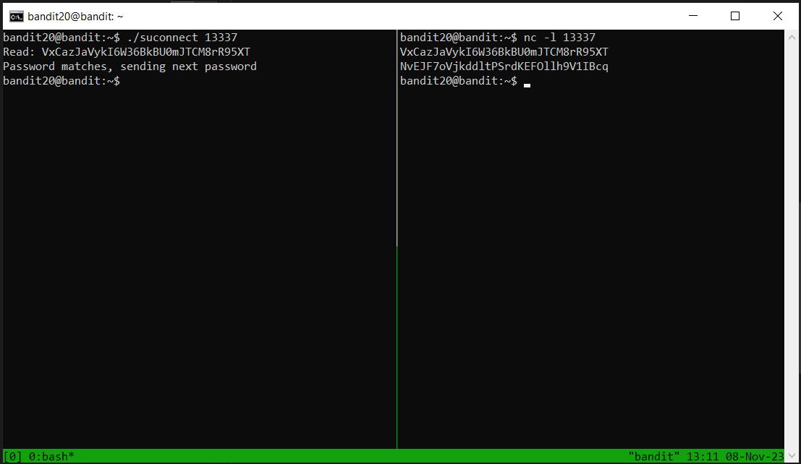

# Level 20 → Level 21

## Level Goal
There is a setuid binary in the homedirectory that does the following: it makes a connection to localhost on the port you specify as a commandline argument. It then reads a line of text from the connection and compares it to the password in the previous level (bandit20). If the password is correct, it will transmit the password for the next level (bandit21).

**NOTE:** Try connecting to your own network daemon to see if it works as you think

## Commands you may need to solve this level
ssh, nc, cat, bash, screen, tmux, Unix ‘job control’ (bg, fg, jobs, &, CTRL-Z, …)

## My first solution
terminal-1:
```
ssh bandit20@bandit.labs.overthewire.org -p 2220
```
```
VxCazJaVykI6W36BkBU0mJTCM8rR95XT
```
```
vim /tmp/myServer.py
```
```python
# copy to /tmp/myServer.py
import socket
prev_password = b'VxCazJaVykI6W36BkBU0mJTCM8rR95XT'

# listen in port 13337
ls = socket.socket()
ls.bind(('',13337))
ls.listen(1)
cs, _ = ls.accept()

# send the previous password
cs.sendall(prev_password)

# print the next password
print(cs.recv(1024))
```
```
python3 /tmp/myServer.py
```

terminal-2:
```
ssh bandit20@bandit.labs.overthewire.org -p 2220
```
```
VxCazJaVykI6W36BkBU0mJTCM8rR95XT
```
```
./suconnect 13337
```

And now look at the terminal-1 output.

## My second solution
```
ssh bandit20@bandit.labs.overthewire.org -p 2220
```
```
VxCazJaVykI6W36BkBU0mJTCM8rR95XT
```
```
tmux
```
* Type: `ctrl+b %` to split the window.

In right window:
```
nc -l 13337
```
In left window:
```
./suconnect 13337
```
In rigth window:
```
VxCazJaVykI6W36BkBU0mJTCM8rR95XT
```

</img>


## Password for the next level
```
NvEJF7oVjkddltPSrdKEFOllh9V1IBcq
```
