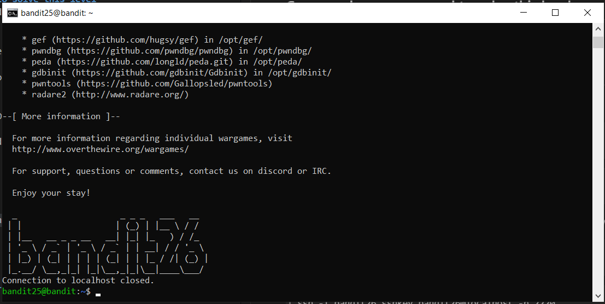
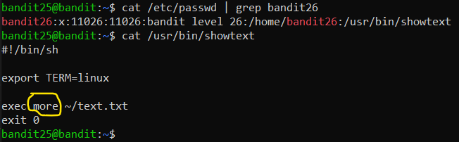
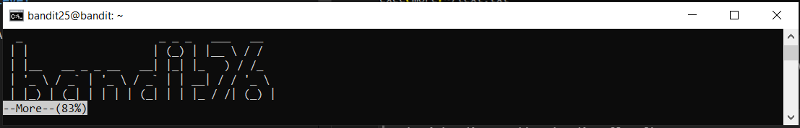

# Level 25 → Level 26

## Level Goal
Logging in to bandit26 from bandit25 should be fairly easy… The shell for user bandit26 is not **/bin/bash**, but something else. Find out what it is, how it works and how to break out of it.

## Commands you may need to solve this level
ssh, cat, more, vi, ls, id, pwd

## Solution
As usual, we will join the challenge at the current stage:
```
ssh bandit25@bandit.labs.overthewire.org -p 2220
```
```
p7TaowMYrmu23Ol8hiZh9UvD0O9hpx8d
```
We will find that, as said, you can easily connect to the next step, apparently:
```
ls
```
```
ssh -i bandit26.sshkey bandit26@localhost -p 2220
```
But..

</img>

Maybe it's relevant to what was said about the shell<br />
Therefore we will look for the default shell of bandit26:

```
cat /etc/passwd | grep bandit26
```
```
cat /usr/bin/showtext
```

</img>

So in order to connect and not log out immediately, we will connect again when the screen is reduced and does not show everything:

```
ssh -i bandit26.sshkey bandit26@localhost -p 2220
```
</img>

Now we will try to start vim (v), and change the file (:e) to be the one that contains the password:

```
v
```
```
:e /etc/bandit_pass/bandit26
```

## Password for the next level
```
c7GvcKlw9mC7aUQaPx7nwFstuAIBw1o1
```
