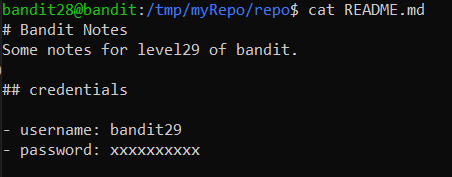

# Level 28 → Level 29

## Level Goal
There is a git repository at **ssh://bandit28-git@localhost/home/bandit28-git/repo** via the port **2220**. The password for the user **bandit28-git** is the same as for the user **bandit28**.

Clone the repository and find the password for the next level.

## Commands you may need to solve this level
git

## Solution
```
ssh bandit28@bandit.labs.overthewire.org -p 2220
```
```
AVanL161y9rsbcJIsFHuw35rjaOM19nR
```
```
mkdir /tmp/myRepo
```
```
cd /tmp/myRepo
```
```
git clone ssh://bandit28-git@localhost:2220/home/bandit28-git/repo
```
```
AVanL161y9rsbcJIsFHuw35rjaOM19nR
```
```
ls -all
```
```
cd repo
```
```
ls -all
```
```
cat README.md
```
But...

</img>

So let's check if there are earlier versions of the repo:

```
git log
```

</img>

It seems that the last commit was made to fix an information leak. And so we restore the commit before it.

```
git reset --hard f08b9cc63fa1a4602fb065257633c2dae6e5651b
```
```
cat README.md
```
```
cd ~
```
```
rm -r /tmp/myRepo
```

## Password for the next level
```
tQKvmcwNYcFS6vmPHIUSI3ShmsrQZK8S
```
