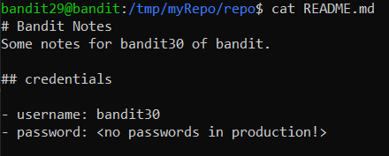
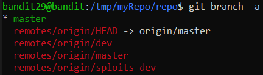

# Level 29 → Level 30

## Level Goal
There is a git repository at **ssh://bandit29-git@localhost/home/bandit29-git/repo** via the port **2220**. The password for the user **bandit29-git** is the same as for the user **bandit29**.

Clone the repository and find the password for the next level.

## Commands you may need to solve this level
ls

## Solution
```
ssh bandit29@bandit.labs.overthewire.org -p 2220
```
```
tQKvmcwNYcFS6vmPHIUSI3ShmsrQZK8S
```
```
mkdir /tmp/myRepo
```
```
cd /tmp/myRepo
```
```
git clone ssh://bandit29-git@localhost:2220/home/bandit29-git/repo
```
```
tQKvmcwNYcFS6vmPHIUSI3ShmsrQZK8S
```
```
ls -all
```
```
cd repo
```
```
ls -all
```
```
cat README.md
```

But...

</img>

Now the password is not part of the project itself (which is exposed to the user). So let's look for it in other branches other than `master`:

```
git branch -a
```

</img>

Let's try the `dev` branch:

```
git switch dev
```
```
cat README.md
```
```
cd ~
```
```
rm -r /tmp/myRepo
```

## Password for the next level
```
xbhV3HpNGlTIdnjUrdAlPzc2L6y9EOnS
```
