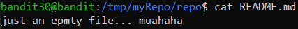

# Level 30 → Level 31

## Level Goal
There is a git repository at **ssh://bandit30-git@localhost/home/bandit30-git/repo** via the port **2220**. The password for the user **bandit30-git** is the same as for the user **bandit30**.

Clone the repository and find the password for the next level.

## Commands you may need to solve this level
git

## Solution
```
ssh bandit30@bandit.labs.overthewire.org -p 2220
```
```
xbhV3HpNGlTIdnjUrdAlPzc2L6y9EOnS
```
```
mkdir /tmp/myRepo
```
```
cd /tmp/myRepo
```
```
git clone ssh://bandit30-git@localhost:2220/home/bandit30-git/repo
```
```
xbhV3HpNGlTIdnjUrdAlPzc2L6y9EOnS
```
```
cd repo
```
```
ls -all
```
```
cat README.md
```

But...

</img>

Attempts to search for `commits` from the past and other `branches` did not yield results. But, what about `tags`?

```
git tag
```
```
git show secret
```
```
cd ~
```
```
rm -r /tmp/myRepo
```

## Password for the next level
```
OoffzGDlzhAlerFJ2cAiz1D41JW1Mhmt
```
