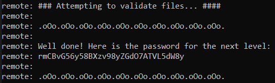

# Level 31 → Level 32

## Level Goal
There is a git repository at **ssh://bandit31-git@localhost/home/bandit31-git/repo** via the port **2220**. The password for the user **bandit31-git** is the same as for the user **bandit31**.

Clone the repository and find the password for the next level.

## Commands you may need to solve this level
git

## Solution
```
ssh bandit31@bandit.labs.overthewire.org -p 2220
```
```
OoffzGDlzhAlerFJ2cAiz1D41JW1Mhmt
```
```
mkdir /tmp/myRepo
```
```
cd /tmp/myRepo
```
```
git clone ssh://bandit31-git@localhost:2220/home/bandit31-git/repo
```
```
OoffzGDlzhAlerFJ2cAiz1D41JW1Mhmt
```
```
cd repo
```
```
ls -all
```
```
cat README.md
```

</img>

```
vim key.txt
```
Copy & Paste the next text:
```
May I come in?
```
```
git add key.txt
```

But...

</img>

So, let's force it:

```
git add -f key.txt
```
```
git commit -m "add key.txt"
```
```
git push origin master
```
```
OoffzGDlzhAlerFJ2cAiz1D41JW1Mhmt
```

The test was successful:

</img>

## Password for the next level
```
rmCBvG56y58BXzv98yZGdO7ATVL5dW8y
```
