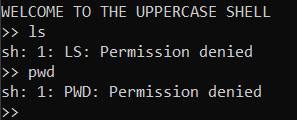
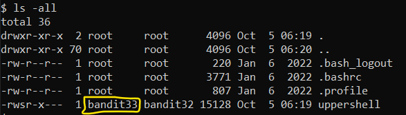

# Level 32 → Level 33

## Level Goal
After all this **git** stuff its time for another escape. Good luck!

## Commands you may need to solve this level
sh, man

## Solution
```
ssh bandit32@bandit.labs.overthewire.org -p 2220
```
```
rmCBvG56y58BXzv98yZGdO7ATVL5dW8y
```
It seems that any input we enter will be converted to uppercase letters and run by `sh`:

</img>

It is known that the value stored in $0 contains the name of the script that runs it. If the script that run the commands is `sh`, and it will run `sh` as a command, we can escape from the `UPPERCASE SHELL`.

```
$0
```
```
ls -all
```

The user running the uppercase shell is actually bandit33:

</img>

We can verify this like this:

```
whoami
```

Therefore we will also have access to the password. But before that, just for fun, we'll switch to the familiar `bash`.
```
bash
```
```
cat /etc/bandit_pass/bandit33
```

## Password for the next level
```
odHo63fHiFqcWWJG9rLiLDtPm45KzUKy
```
