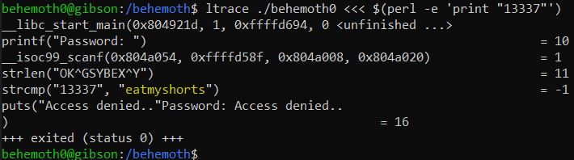
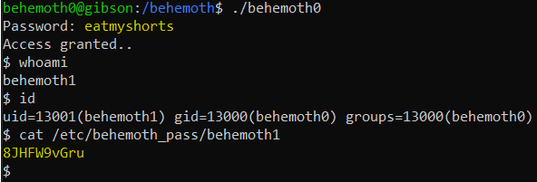

# Level 0 → Level 1

## Solution
```
ssh behemoth0@behemoth.labs.overthewire.org -p 2221
```
```
behemoth0
```
```
cd /behemoth ; ls -al
```
```
ltrace ./behemoth0 <<< $(perl -e 'print "13337"')
```



```
./behemoth0
```
```
eatmyshorts
```



## Password for the next level:
```
8JHFW9vGru
```
