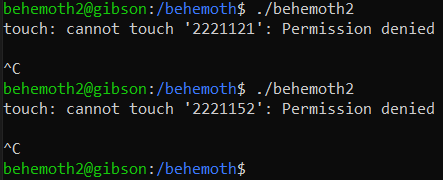
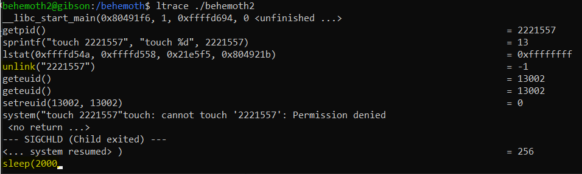
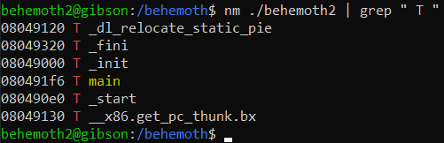

# Level 2 → Level 3

## Solution
```
ssh behemoth2@behemoth.labs.overthewire.org -p 2221
```
```
udgJeGECEW
```
```
cd /behemoth ; ls -al
```
```
./behemoth2
```



```
ltrace ./behemoth2
```




```
nm ./behemoth2 | grep " T "
```



* Just `main` function.

```
gdb ./behemoth2
```
```
set disassembly-flavor intel
```
```
disas main
```

TODO: control the PID with https://efiop-notes.blogspot.com/2014/06/how-to-set-pid-using-nslastpid.html

## Password for the next level:
```

```
