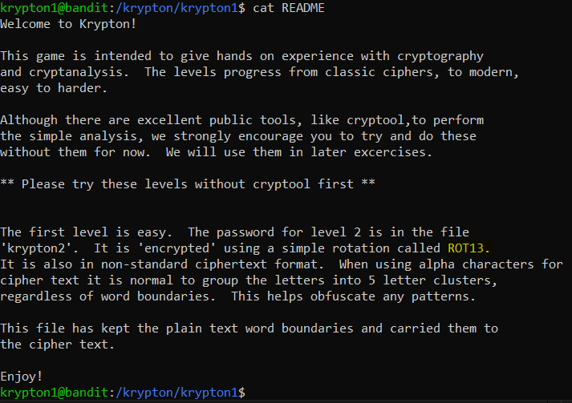
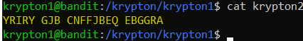
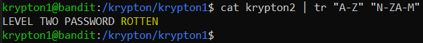

# Level 1 → Level 2

## Level Info
The password for level 2 is in the file ‘krypton2’. It is ‘encrypted’ using a simple rotation. It is also in non-standard ciphertext format. When using alpha characters for cipher text it is normal to group the letters into 5 letter clusters, regardless of word boundaries. This helps obfuscate any patterns. This file has kept the plain text word boundaries and carried them to the cipher text.<br />
Enjoy!

## Solution
```
ssh krypton1@krypton.labs.overthewire.org -p 2231
```
```
KRYPTONISGREAT
```
```
cd /krypton/krypton1 ; ls -al
```
```
cat README
```



```
cat krypton2
```



So what is `YRIRY GJB CNFFJBEQ EBGGRA`? Le's decrypt it using `tr` command:

```
cat krypton2 | tr "A-Z" "N-ZA-M"
```



## Password for the next level:
```
ROTTEN
```
