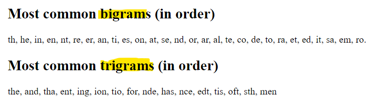
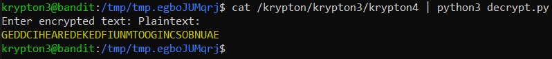

# Level 3 → Level 4

## Level Info
Well done. You’ve moved past an easy substitution cipher.

The main weakness of a simple substitution cipher is repeated use of a simple key. In the previous exercise you were able to introduce arbitrary plaintext to expose the key. In this example, the cipher mechanism is not available to you, the attacker.

However, you have been lucky. You have intercepted more than one message. The password to the next level is found in the file ‘krypton4’. You have also found 3 other files. (found1, found2, found3)

You know the following important details:

* The message plaintexts are in American English (*** very important) - They were produced from the same key (*** even better!)<br />
Enjoy.

## Solution
```
ssh krypton3@krypton.labs.overthewire.org -p 2231
```
```
CAESARISEASY
```
```
cd /krypton/krypton3 ; ls -al
```

Since the additional files (file1, file2 and file3) are quite large, and since there is an emphasis on the source language, my suspicion is that it is a substitution cipher that can be broken by the frequency of the letters. Below is a Python code that prints the number of occurrences of letters for the given file:

```
cd $(mktemp -d)
```
```python
# frequency.py
from string import ascii_uppercase as upper

# Get file content
with open(input('Enter filename: '), 'r') as f:
    content = f.read()

# Create the dict {letter:amount}
d = {l:content.count(l) for l in upper}

# Sorted the dict by amount
print({k:v for k,v in sorted(d.items(), key=lambda x:x[1], reverse=True)})
```

Because it is a given that all the files are from the same key, so in order to be precise in finding the frequency I will combine them:

```
cat /krypton/krypton3/found1 /krypton/krypton3/found2 /krypton/krypton3/found3 /krypton/krypton3/krypton4 > encrypted
```
```
python3 frequency.py
```


So, The result for the 'foundX' files are:
```python
{'S': 462, 'Q': 341, 'J': 303, 'U': 260, 'B': 249, 'N': 243, 'C': 228, 'G': 228, 'D': 211, 'V': 134, 'Z': 132, 'W': 131, 'M': 88, 'Y': 85, 'T': 75, 'X': 72, 'K': 69, 'E': 64, 'L': 60, 'A': 56, 'F': 28, 'I': 20, 'O': 12, 'H': 4, 'R': 4, 'P': 2}
```

And you can read [here](https://mathcenter.oxford.emory.edu/site/math125/englishLetterFreqs/) about frequencies and find out the following:


Can I guess the key? Maybe. But the amount here is no enough.. so we can use in this also:



In the following Python code we will try to decrypt the key. Little by little he will improve:

```python
# decrypt.py

# this two lines (together) may be the key:
enc_alphabet  = 'SQJUBNCGDVZWMYTXKELAFIOHRP'
dec_frequency = 'ETAOINSHRDLCUMWFGYPBVKJXQZ'

encrypted = input('Enter encrypted text: ')
plaintext = ''

for l in encrypted:
    if l.isupper():
        plaintext += dec_frequency[enc_alphabet.find(l)]

print("Plaintext:\n" + plaintext)
```



No sense (even in the `foundX` files...). But Im sure that `S` is `E` in the plaintext. We will now search by common trigrams:

```python
# frequency_trigrams.py
from string import ascii_uppercase as upper

# Get file content
with open(input('Enter filename: '), 'r') as f:
    content = f.read().replace(' ', '')

# Create the dict {trigram:amount}
d = {l1+l2+l3:content.count(l1+l2+l3) for l1 in upper for l2 in upper for l3 in upper}

# Sorted the dict by amount
print({k:v for k,v in sorted(d.items(), key=lambda x:x[1], reverse=True) if v > 1})
```

```
python3 frequency_trigrams.py
```


Result here:
```python
{'JDS': 62, 'QGW': 27, 'SQN': 23, 'DSN': 22, 'DCU': 19, 'SNS': 19, 'CGE': 16, 'JSN': 16, 'CBG': 15, 'JDQ': 15, 'JCB': 14, 'SUY': 14, 'UDQ': 14, 'BXJ': 13, 'QNS': 13, 'SUQ': 13, 'SWC': 13, 'SWQ': 13, 'UYS': 13, 'YSQ': 13, 'DQF': 12, 'FSU': 12, 'NJD': 12, 'QFS': 12, 'XJD': 12, 'JSW': 11, 'SGJ': 11, 'UJS': 11, 'WJD': 11, 'XBN': 11, 'YDS': 11, 'DSQ': 10, 'GJD': 10, 'QNU': 10, 'SSG': 10, 'STQ': 10, 'BKG': 9, 'DQJ': 9, 'SBX': 9, 'SJD': 9, 'SNJ': 9, 'UJB': 9, 'UZD': 9, 'ZDB': 9, 'BGU': 8, 'BTS': 8, 'CGJ': 8, 'CYD': 8, 'ENQ': 8, 'GWQ': 8, 'GZS': 8, 'NQG': 8, 'QES': 8, 'QIS': 8, 'QJC': 8, 'QJJ': 8, 'QJS': 8, 'SWJ': 8, 'TQN': 8, 'WBG': 8, 'WCG': 8, 'ZBM': 8, 'ZCY': 8, 'BJD': 7, 'CJD': 7, 'CUJ': 7, 'CZQ': 7, 'EDJ': 7, 'GBK': 7, 'GJC': 7, 'JBX': 7, 'KQU': 7, 'NSU': 7, 'NSY': 7, 'QNJ': 7, 'QSU': 7, 'QUU': 7, 'SCG': 7, 'SNC': 7, 'SNQ': 7, 'SNU': 7, 'SZB': 7, 'UJD': 7, 'UQN': 7, 'USW': 7, 'YVQ': 7, 'ZQJ': 7, 'ZQS': 7, 'ASJ': 6, 'BBV': 6, 'BUJ': 6, 'CGU': 6, 'CSU': 6, 'CUS': 6, 'DBB': 6, 'DQI': 6, 'DQU': 6, 'DSZ': 6, 'FGB': 6, 'JBN': 6, 'JCG': 6, 'JCU': 6, 'JJD': 6, 'KBN': 6, 'KCJ': 6, 'KSN': 6, 'NCS': 6, 'NNC': 6, 'NST': 6, 'QGZ': 6, 'QNN': 6, 'QUJ': 6, 'QVV': 6, 'SQJ': 6, 'SUJ': 6, 'WQU': 6, 'XJS': 6, 'ZBT': 6, 'ZSU': 6, 'BGJ': 5, 'BGS': 5, 'BMV': 5, 'BNJ': 5, 'BNW': 5, 'BVV': 5, 'BXD': 5, 'CGZ': 5, 'CUD': 5, 'CWS': 5, 'DST': 5, 'DSU': 5, 'GEV': 5, 'GQG': 5, 'GUC': 5, 'GUJ': 5, 'GWB': 5, 'JDB': 5, 'JKB': 5, 'JNQ': 5, 'JXB': 5, 'LDQ': 5, 'MED': 5, 'MGJ': 5, 'MJC': 5, 'MVW': 5, 'NQJ': 5, 'NSQ': 5, 'NSS': 5, 'NSZ': 5, 'QJN': 5, 'QXJ': 5, 'SGS': 5, 'SGZ': 5, 'SJK': 5, 'SUC': 5, 'SUD': 5, 'SUZ': 5, 'SWA': 5, 'TSW': 5, 'TYV': 5, 'UBX': 5, 'UCG': 5, 'UDS': 5, 'UJQ': 5, 'UQG': 5, 'UZQ': 5, 'WCJ': 5, 'WQG': 5, 'YJC': 5, 'YVS': 5, 'ZSG': 5, 'ASN': 4, 'ASS': 4, 'BEN': 4, 'BGQ': 4, 'BGW': 4, 'BMG': 4, 'BMN': 4, 'BNC': 4, 'BXU': 4, 'CED': 4, 'CGV': 4, 'CJC': 4, 'CJL': 4, 'CQE': 4, 'CSW': 4, 'CTS': 4, 'DBV': 4, 'DSK': 4, 'DSS': 4, 'DSW': 4, 'DSY': 4, 'ESG': 4, 'GCG': 4, 'GCZ': 4, 'GJB': 4, 'GJS': 4, 'GWJ': 4, 'GWU': 4, 'JDC': 4, 'JDZ': 4, 'JJS': 4, 'JKS': 4, 'JMN': 4, 'JSG': 4, 'JUD': 4, 'LSQ': 4, 'LZB': 4, 'MNC': 4, 'NCG': 4, 'NCQ': 4, 'NCZ': 4, 'NJB': 4, 'NJS': 4, 'NLY': 4, 'NQV': 4, 'NQY': 4, 'QAS': 4, 'QCG': 4, 'QGG': 4, 'QJD': 4, 'QJU': 4, 'QLU': 4, 'QNQ': 4, 'QUS': 4, 'QVU': 4, 'QYD': 4, 'QZQ': 4, 'QZS': 4, 'SGQ': 4, 'SOJ': 4, 'SQE': 4, 'SQG': 4, 'SWB': 4, 'SYV': 4, 'SZJ': 4, 'TBU': 4, 'UBT': 4, 'UDC': 4, 'UJC': 4, 'UQJ': 4, 'UUM': 4, 'VBG': 4, 'VCU': 4, 'VJD': 4, 'VQG': 4, 'VQL': 4, 'VQU': 4, 'VSQ': 4, 'WAL': 4, 'WCS': 4, 'WDQ': 4, 'WSN': 4, 'XDC': 4, 'YDQ': 4, 'ZBV': 4, 'ZNL': 4, 'ZQV': 4, 'ABM': 3, 'ACB': 3, 'ALQ': 3, 'AUJ': 3, 'BBX': 3, 'BGC': 3, 'BGX': 3, 'BGZ': 3, 'BKS': 3, 'BME': 3, 'BMJ': 3, 'BNQ': 3, 'BNZ': 3, 'BQZ': 3, 'BUS': 3, 'BVC': 3, 'BVQ': 3, 'BXQ': 3, 'BZB': 3, 'CBE': 3, 'CGK': 3, 'CJK': 3, 'CUB': 3, 'CVV': 3, 'CXJ': 3, 'CZD': 3, 'DBM': 3, 'DCX': 3, 'DJB': 3, 'DJS': 3, 'DQG': 3, 'DQN': 3, 'DQT': 3, 'DQV': 3, 'DSA': 3, 'DZS': 3, 'FCG': 3, 'GED': 3, 'GEJ': 3, 'GJM': 3, 'GNS': 3, 'GQU': 3, 'GSJ': 3, 'GSN': 3, 'GWC': 3, 'GXB': 3, 'GZN': 3, 'GZV': 3, 'HMQ': 3, 'ISA': 3, 'JBJ': 3, 'JCT': 3, 'JCV': 3, 'JCZ': 3, 'JKC': 3, 'JKQ': 3, 'JNS': 3, 'JQG': 3, 'JST': 3, 'KBB': 3, 'KBM': 3, 'KDB': 3, 'KDC': 3, 'LJD': 3, 'LYJ': 3, 'MAU': 3, 'MNL': 3, 'MQV': 3, 'MUS': 3, 'NBJ': 3, 'NBM': 3, 'NBT': 3, 'NCU': 3, 'NLU': 3, 'NQT': 3, 'NQZ': 3, 'NSK': 3, 'NSX': 3, 'NUJ': 3, 'NUQ': 3, 'NUS': 3, 'NUZ': 3, 'NZC': 3, 'QAB': 3, 'QEN': 3, 'QME': 3, 'QNB': 3, 'QNZ': 3, 'QTS': 3, 'QUQ': 3, 'QVC': 3, 'QVJ': 3, 'QVS': 3, 'SAQ': 3, 'SAS': 3, 'SCE': 3, 'SDQ': 3, 'SGW': 3, 'SKC': 3, 'SKS': 3, 'SNB': 3, 'SOQ': 3, 'SSJ': 3, 'SUB': 3, 'SUM': 3, 'SUU': 3, 'SXC': 3, 'SYN': 3, 'SZM': 3, 'TQG': 3, 'TQL': 3, 'TQU': 3, 'TSJ': 3, 'UBG': 3, 'UGS': 3, 'UJN': 3, 'UKS': 3, 'UMA': 3, 'USQ': 3, 'USU': 3, 'USZ': 3, 'UUD': 3, 'VBU': 3, 'VCZ': 3, 'VQZ': 3, 'VSJ': 3, 'VSU': 3, 'VVB': 3, 'VVS': 3, 'VWD': 3, 'WAS': 3, 'WBX': 3, 'WMZ': 3, 'WQV': 3, 'WQX': 3, 'WSW': 3, 'WUJ': 3, 'YBN': 3, 'YNB': 3, 'YSN': 3, 'ZBG': 3, 'ZDQ': 3, 'ZMN': 3, 'ZSB': 3, 'ZSN': 3, 'ZSW': 3, 'ACN': 2, 'AMJ': 2, 'AMN': 2, 'ANB': 2, 'ANM': 2, 'AQY': 2, 'ASZ': 2, 'AVC': 2, 'AVQ': 2, 'BFG': 2, 'BGB': 2, 'BJS': 2, 'BJU': 2, 'BLS': 2, 'BNF': 2, 'BNL': 2, 'BNS': 2, 'BNT': 2, 'BTQ': 2, 'BTT': 2, 'BVT': 2, 'BVW': 2, 'BWS': 2, 'BXI': 2, 'CBW': 2, 'CGD': 2, 'CGQ': 2, 'CGS': 2, 'CIS': 2, 'CJM': 2, 'CNJ': 2, 'CNU': 2, 'CTY': 2, 'CUE': 2, 'CUU': 2, 'CUV': 2, 'CUW': 2, 'CUY': 2, 'CZB': 2, 'CZS': 2, 'DCG': 2, 'DCZ': 2, 'DQA': 2, 'DQK': 2, 'DSC': 2, 'DSJ': 2, 'DSL': 2, 'DSV': 2, 'DSX': 2, 'EDC': 2, 'EJD': 2, 'ENS': 2, 'ESB': 2, 'ESU': 2, 'ESW': 2, 'EVQ': 2, 'EVS': 2, 'GBX': 2, 'GCU': 2, 'GDC': 2, 'GEQ': 2, 'GEU': 2, 'GFG': 2, 'GGS': 2, 'GKD': 2, 'GQM': 2, 'GQT': 2, 'GSC': 2, 'GSG': 2, 'GSO': 2, 'GSQ': 2, 'GSU': 2, 'GSW': 2, 'GUB': 2, 'GUS': 2, 'GVL': 2, 'GWA': 2, 'GWD': 2, 'GWK': 2, 'GWT': 2, 'GZC': 2, 'GZQ': 2, 'ICW': 2, 'IQN': 2, 'ISN': 2, 'ISQ': 2, 'IST': 2, 'JAC': 2, 'JBG': 2, 'JBQ': 2, 'JBZ': 2, 'JCJ': 2, 'JCQ': 2, 'JCX': 2, 'JDD': 2, 'JDN': 2, 'JJK': 2, 'JMJ': 2, 'JNC': 2, 'JNL': 2, 'JQJ': 2, 'JSO': 2, 'JSS': 2, 'JSU': 2, 'KCG': 2, 'KCV': 2, 'KGJ': 2, 'KGQ': 2, 'KGS': 2, 'KJD': 2, 'KNB': 2, 'KQL': 2, 'KSS': 2, 'KSW': 2, 'LBX': 2, 'LCG': 2, 'LNS': 2, 'LQV': 2, 'LQZ': 2, 'LUG': 2, 'LUJ': 2, 'LUK': 2, 'LUZ': 2, 'LWM': 2, 'MAV': 2, 'MGC': 2, 'MGF': 2, 'MJJ': 2, 'MJS': 2, 'MNQ': 2, 'MNU': 2, 'MQN': 2, 'MSU': 2, 'MUQ': 2, 'MWC': 2, 'MZD': 2, 'MZQ': 2, 'NBG': 2, 'NBU': 2, 'NBX': 2, 'NCB': 2, 'NDC': 2, 'NJC': 2, 'NKD': 2, 'NLD': 2, 'NQA': 2, 'NQE': 2, 'NRM': 2, 'NSJ': 2, 'NSM': 2, 'NSW': 2, 'NTS': 2, 'NUA': 2, 'NUB': 2, 'NUD': 2, 'NWQ': 2, 'NWV': 2, 'NXB': 2, 'NYB': 2, 'NZQ': 2, 'NZS': 2, 'OQT': 2, 'QGE': 2, 'QGL': 2, 'QJX': 2, 'QKQ': 2, 'QLD': 2, 'QLJ': 2, 'QMU': 2, 'QNL': 2, 'QNW': 2, 'QTG': 2, 'QTQ': 2, 'QTT': 2, 'QTY': 2, 'QUA': 2, 'QUD': 2, 'QUN': 2, 'QUY': 2, 'QUZ': 2, 'QVY': 2, 'QVZ': 2, 'QWB': 2, 'QYJ': 2, 'QYY': 2, 'QZB': 2, 'QZD': 2, 'QZF': 2, 'QZZ': 2, 'SAC': 2, 'SEN': 2, 'SGE': 2, 'SGN': 2, 'SIC': 2, 'SJC': 2, 'SJJ': 2, 'SKN': 2, 'SLS': 2, 'SMG': 2, 'SMU': 2, 'SND': 2, 'SNR': 2, 'SNX': 2, 'SNY': 2, 'SNZ': 2, 'SQU': 2, 'SQV': 2, 'SQW': 2, 'SQZ': 2, 'SSN': 2, 'SSO': 2, 'SSW': 2, 'STB': 2, 'STS': 2, 'STY': 2, 'SVC': 2, 'SVL': 2, 'SVV': 2, 'SWM': 2, 'SWT': 2, 'SXN': 2, 'SXS': 2, 'SYB': 2, 'SYS': 2, 'SZQ': 2, 'TAS': 2, 'TBG': 2, 'TGS': 2, 'TMG': 2, 'TQC': 2, 'TSG': 2, 'TSU': 2, 'TTM': 2, 'TTQ': 2, 'UBF': 2, 'UBY': 2, 'UCJ': 2, 'UCO': 2, 'UCW': 2, 'UES': 2, 'UJA': 2, 'UKC': 2, 'UMN': 2, 'UMZ': 2, 'UNB': 2, 'UNS': 2, 'UQV': 2, 'USB': 2, 'USG': 2, 'UUC': 2, 'UVQ': 2, 'UXB': 2, 'UYB': 2, 'UYQ': 2, 'UZC': 2, 'VBK': 2, 'VCJ': 2, 'VLA': 2, 'VMW': 2, 'VQA': 2, 'VQJ': 2, 'VQN': 2, 'VSE': 2, 'VSO': 2, 'VSX': 2, 'VSZ': 2, 'VTQ': 2, 'VUB': 2, 'VUJ': 2, 'VVJ': 2, 'VWA': 2, 'VYD': 2, 'WBK': 2, 'WCU': 2, 'WDC': 2, 'WMN': 2, 'WQJ': 2, 'WQM': 2, 'WQN': 2, 'WQZ': 2, 'WTB': 2, 'WTQ': 2, 'WUB': 2, 'XBV': 2, 'XCN': 2, 'XNB': 2, 'XSN': 2, 'XUD': 2, 'YBU': 2, 'YMA': 2, 'YQN': 2, 'YYS': 2, 'ZBN': 2, 'ZDC': 2, 'ZDS': 2, 'ZJC': 2, 'ZJS': 2, 'ZQM': 2, 'ZQN': 2, 'ZQU': 2, 'ZVM': 2, 'ZVQ': 2}
```

It is possible that the encrypted word `JDS` is actually the word `THE`, and `JDQ` is `THA` Let's check it out:

```python
# decrypt2.py

# this two lines (together) may be the key:
enc_alphabet  = 'SJQUBNCDGVZWMYTXKELAFIOHRP'
dec_frequency = 'ETAOINSHRDLCUMWFGYPBVKJXQZ'

encrypted = input('Enter encrypted text: ')
plaintext = ''

for l in encrypted:
    if l.isupper():
        plaintext += dec_frequency[enc_alphabet.find(l)]

print("Plaintext:\n" + plaintext)
```
```
cat /krypton/krypton3/krypton4 | python3 decrypt2.py | grep THE
```


Maybe the word `DEKED` is actualy `LEVEL`?
The encrypted password is `KSVVWBGS JDS VSISV XBMNYQUUKBNWCUANMJS`, so it means `V` is `L` and `I` is `V`

```python
# decrypt3.py

# this two lines (together) may be the key:
enc_alphabet  = 'SJQUBNCDGZVWMYTXKELAIFOHRP'
dec_frequency = 'ETAOINSHRDLCUMWFGYPBVKJXQZ'

encrypted = input('Enter encrypted text: ')
plaintext = ''

for l in encrypted:
    if l.isupper():
        plaintext += dec_frequency[enc_alphabet.find(l)]

print("Plaintext:\n" + plaintext)
```


It's nice but still not very clear. In level `Level1 to Level2` the decrypted text was `LEVEL TWO PASSWORD ...`. Maybe here is `...THE LEVEL FOUR PASSWORD...`.
It can be work becaues the `OO` in the place of `SS`.

So, the encrypted password is `KSVVWBGS JDS VSISV XBMN YQUUKBNW CUANMJS`. It means that we can fix the **encryption** key with: `O->B`, `R->N`, `P->Y`, `S->U`, `W->K`, `D->W`

```python
# decrypt4.py

# this two lines (together) may be the key:
enc_alphabet  = 'SJQBCGUDNWVZMLKXTEYAIFOHRP'
dec_frequency = 'ETAOINSHRDLCUMWFGYPBVKJXQZ'

encrypted = input('Enter encrypted text: ')
plaintext = ''

for l in encrypted:
    if l.isupper():
        plaintext += dec_frequency[enc_alphabet.find(l)]

print("Plaintext:\n" + plaintext)
```


`WELL DONE THE LEVEL FOUR PASSWORD IS BRUTE`.

This does not mean that we have managed to fully discover the whole key, but we will stop here.

Note: the whole challenge could be done without effort [here](https://www.dcode.fr/monoalphabetic-substitution), once we understood that it was a substitution cipher. All that needs to be done is to connect the contents of the four files (3 `foundX` and the password file `krypton4`) to the website. Exactly for the same reason that we combined them into an `encrypted` file.

```
exit
```
```
rm -r /tmp/tmp.egboJUMqrj
```

## Password for the next level:
```
BRUTE
```