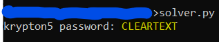

# Level 4 → Level 5

## Level Info
Good job!

You more than likely used some form of FA and some common sense to solve that one.

So far we have worked with simple substitution ciphers. They have also been ‘monoalphabetic’, meaning using a fixed key, and giving a one to one mapping of plaintext (P) to ciphertext (C). Another type of substitution cipher is referred to as ‘polyalphabetic’, where one character of P may map to many, or all, possible ciphertext characters.

An example of a polyalphabetic cipher is called a Vigenère Cipher. It works like this:

If we use the key(K) ‘GOLD’, and P = PROCEED MEETING AS AGREED, then “add” P to K, we get C. When adding, if we exceed 25, then we roll to 0 (modulo 26).

```
|P| P R O C E E D M E E T I N G A S A G R E E D
|K| G O L D G O L D G O L D G O L D G O L D G O
```
becomes:

```
|P| 15 17 14 2 4 4 3 12 4 4 19 8 13 6 0 18 0 6 17 4 4 3
|K| 6 14 11 3 6 14 11 3 6 14 11 3 6 14 11 3 6 14 11 3 6 14
|C| 21 5 25 5 10 18 14 15 10 18 4 11 19 20 11 21 6 20 2 8 10 17
```
So, we get a ciphertext of:

```
VFZFK SOPKS ELTUL VGUCH KR
```

This level is a Vigenère Cipher. You have intercepted two longer, english language messages (American English). You also have a key piece of information. You know the key length!

For this exercise, the key length is 6. The password to level five is in the usual place, encrypted with the 6 letter key.

Have fun!

## Solution
```
ssh krypton4@krypton.labs.overthewire.org -p 2231
```
```
BRUTE
```
```
cd /krypton/krypton4 ; ls -al
```
```
cat found1
```
```
cat fount2
```


```
cat krypton5
```


After some thinking I guess this is the way to find out the encryption key:
* Consolidation of the two texts found1 and found2 (for a more accurate analysis)
     * Don't forget to add some bytes needed to pad the first file whose size will be divisible by 6
* Creating 6 strings where each group is all the characters from the same index modulo 6
* In each of the strings we will find the character that appears the most times
* Calculate the difference between the character E and each of the characters we found
* We will connect them to be the key
* We will use the key to decrypt the password.

```python
from string import ascii_uppercase as UPPER

KEY_LEN = 6
FOUND1_PATH = '/krypton/krypton4/found1'
FOUND2_PATH = '/krypton/krypton4/found2'
ENC_KRYPTON5_PASSWORD = 'HCIKVRJOX'

def get_content():
    with open(FOUND1_PATH, 'r') as f:
        content = f.read().replace(' ', '')
    
    # padding
    content += (KEY_LEN - len(content) % KEY_LEN) * '#'

    with open(FOUND2_PATH, 'r') as f:
        content += f.read().replace(' ', '')
    
    return content

def get_most_commen_letter(string):
    return [k for k,v in sorted({l:string.count(l) for l in UPPER}.items(), key=lambda x:x[1], reverse=True)][0]

def decrypt_E(enc_E):
    return chr((ord(enc_E) - ord('E')) % 26 + ord('A'))


def decrypt(enc_txt, k):
    dec = ''
    for i in range(len(enc_txt)):
        dec += chr((ord(enc_txt[i]) - ord(k[i%6])) % 26 + ord('A'))
    return dec


def main():
    # Consolidation of the two texts found1 and found2
    full_enc_content = get_content()
    
    # Creating 6 strings
    groups_by_index = [full_enc_content[i::6] for i in range(6)]
    
    # Find the characters that appears the most times
    enc_E_for_each_group = ''
    for s in groups_by_index:
        enc_E_for_each_group += get_most_commen_letter(s)

    # Calculate the difference between the character E and each of the characters we found
    # and connect them to be the key
    key = ''
    for l in enc_E_for_each_group:
        key += decrypt_E(l)

    # Using this key to decrypt the password.
    krypton5_password = decrypt(ENC_KRYPTON5_PASSWORD, key)
    print("krypton5 password:", krypton5_password)

if __name__ == '__main__':
    main()
```

It is worth noting that the code was written after the solution was done through the Python interpreter only. To run it outside the challenger's computer all you have to do is change the found1 and found2 file paths and fill them with the same original content (copy paste).




## Password for the next level:
```
CLEARTEXT
```
