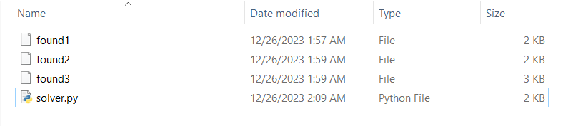
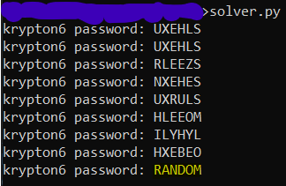

# Level 5 → Level 6

## Level Info
FA can break a known key length as well. Lets try one last polyalphabetic cipher, but this time the key length is unknown. Note: the text is writen in American English

Enjoy.

## Solution
```
ssh krypton5@krypton.labs.overthewire.org -p 2231
```
```
CLEARTEXT
```
```
cd /krypton/krypton5 ; ls -al
```

I was very happy to see this challenge, because all I have to do is slightly change the code from the previous challenge:

```python
from string import ascii_uppercase as UPPER

KEY_LEN = 0 # main() change it.
FOUND1_PATH = '/krypton/krypton5/found1'
FOUND2_PATH = '/krypton/krypton5/found2'
FOUND3_PATH = '/krypton/krypton5/found3'
ENC_KRYPTON6_PASSWORD = 'BELOSZ'

def get_content():
    with open(FOUND1_PATH, 'r') as f:
        content1 = f.read().replace(' ', '')
    
    # padding
    content1 += (KEY_LEN - len(content1) % KEY_LEN) * '#'

    with open(FOUND2_PATH, 'r') as f:
        content2 = f.read().replace(' ', '')
    
    # padding
    content2 += (KEY_LEN - len(content2) % KEY_LEN) * '#'
    
    with open(FOUND3_PATH, 'r') as f:
        content3 = f.read().replace(' ', '')
    
    return content1 + content2 + content3

def get_most_commen_letter(string):
    return [k for k,v in sorted({l:string.count(l) for l in UPPER}.items(), key=lambda x:x[1], reverse=True)][0]

def decrypt_E(enc_E):
    return chr((ord(enc_E) - ord('E')) % 26 + ord('A'))


def decrypt(enc_txt, k):
    dec = ''
    for i in range(len(enc_txt)):
        dec += chr((ord(enc_txt[i]) - ord(k[i%KEY_LEN])) % 26 + ord('A'))
    return dec


def old_main():
    # Consolidation of the two texts found1 and found2
    full_enc_content = get_content()
    
    # Creating KEY_LEN strings
    groups_by_index = [full_enc_content[i::KEY_LEN] for i in range(KEY_LEN)]
    
    # Find the characters that appears the most times
    enc_E_for_each_group = ''
    for s in groups_by_index:
        enc_E_for_each_group += get_most_commen_letter(s)

    # Calculate the difference between the character E and each of the characters we found
    # and connect them to be the key
    key = ''
    for l in enc_E_for_each_group:
        key += decrypt_E(l)

    # Using this key to decrypt the password.
    krypton6_password = decrypt(ENC_KRYPTON6_PASSWORD, key)
    print("krypton6 password:", krypton6_password)

def main():
    for i in range(1, 10):
        global KEY_LEN
        KEY_LEN = i
        old_main()

if __name__ == '__main__':
    main()
```

Note: If you decided to run the code outside the challenge's computer, the files found1, found2 and found3 with the original content must be created locally (cat command then copy paste).





The code above tried on key sizes from 1 to 10 (not inclusive), meaning the encryption key size was 9 characters.

## Password for the next level:
```
RANDOM
```
