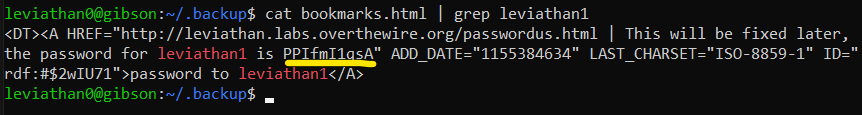

# Level 0 → Level 1

## Solution
```
ssh leviathan0@leviathan.labs.overthewire.org -p 2223
```
```
leviathan0
```
```
ls -all
```
```
cd .backup
```
```
ls -all
```
```
cat bookmarks.html | grep leviathan1
```



```
exit
```

## Password for the next level:
```
PPIfmI1qsA
```
