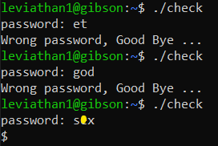

# Level 1 → Level 2

## Solution
```
ssh leviathan1@leviathan.labs.overthewire.org -p 2223
```
```
PPIfmI1qsA
```
```
ls -all
```
```
./check
```


```
strings check
```


I know that systrings displays strings that are 4 or more characters long. Is the password less than that?

```
cat check
```



* I's sorry about this word...

```
bash
```
```
cat /etc/leviathan_pass/leviathan2
```


## Password for the next level:
```
mEh5PNl10e
```
