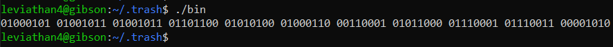
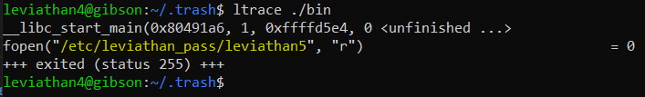
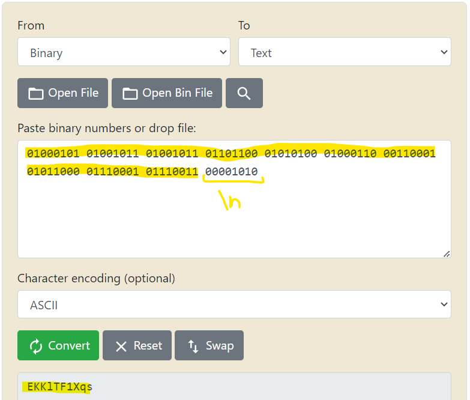

# Level 4 → Level 5

## Solution
```
ssh leviathan4@leviathan.labs.overthewire.org -p 2223
```
```
AgvropI4OA
```
```
ls -al
```
```
cd .trash
```
```
ls -al
```
```
./bin
```



Before we convert to ASCII characters, we will check the origin of these characters:

```
ltrace ./bin
```



Okay, that's what we wanted. Now we will check what are the sequence of bytes `01000101 01001011 01001011 01101100 01010100 01000110 00110001 01011000 01110001 01110011 00001010` using [this site](https://www.rapidtables.com/convert/number/binary-to-ascii.html)



## Password for the next level:
```
EKKlTF1Xqs
```
