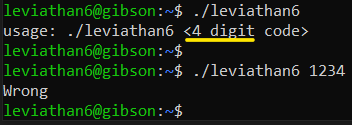
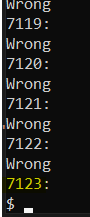
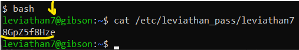

# Level 5 → Level 6

## Solution
```
ssh leviathan6@leviathan.labs.overthewire.org -p 2223
```
```
YZ55XPVk2l
```
```
ls -al
```
```
./leviathan6
```



With `ltrace` or `strace` there is nothing to do. But, just **4-digit** is somthing very brute-force-able...
Let's Built the next `Python` code with `vim`:

```python
# /tmp/bruteforce.py

from os import system

for i in range(9999 + 1):
    print(str(i).zfill(4) + ":")
    system("./leviathan6 " + str(i).zfill(4))
```

```
python3 /tmp/bruteforce.py
```



```
bash
```
```
cat /etc/leviathan_pass/leviathan7
```



```
exit
```
```
exit
```
```
rm /tmp/bruteforce.py
```

## Password for the next level:
```
8GpZ5f8Hze
```
