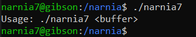

# Level 7 → Level 8

## Solution
```
ssh narnia7@narnia.labs.overthewire.org -p 2226
```
```
YY4F9UaB60
```
```
cd /narnia ; ls -al
```
```
./narnia7
```




Let's look at the code:

```
cat narnia7.c
```

The printed file is shown below:

```c
```

## Password for the next level:
```

```
