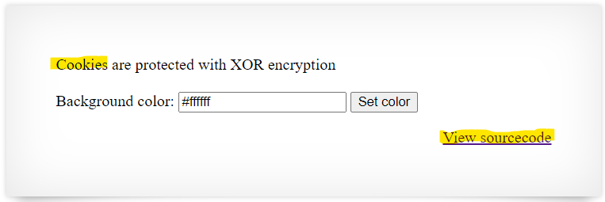
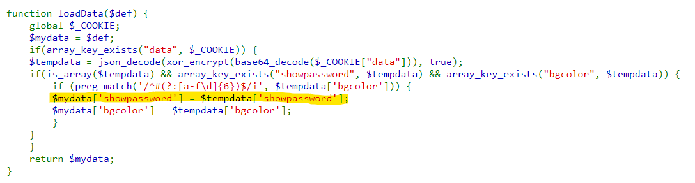

# Level 10 → Level 11

## Details
Username: `natas11`<br />
Password: `1KFqoJXi6hRaPluAmk8ESDW4fSysRoIg`<br />
URL:      http://natas11.natas.labs.overthewire.org

## Solution
Let's get started:

</img>

It seems that you should pay attention to cookies encrypted with xor. Let's look at the source code:

</img>

</img>
</img>

</img>


It seems that the values of the cookie from the user will determine whether the password will be revealed. Therefore we would like to build a cookie accordingly. For this purpose, the following must be done:
* Find a way to decrypt the encrypted cookie
* Build a new malicious cookie
* Encrypt the new cookie and perform a query with it.

Let's look at the process of building the cookie:

</img>

</img>

</img>

I can guess that because the encryption is done on each character separately, and since each cookie will look the same except for color, we can compare cookies of different colors and extract the key.

We will extract the cookie for the white color `#ffffff`: `MGw7JCQ5OC04PT8jOSpqdmkgJ25nbCorKCEkIzlscm5oKC4qLSgubjY=`

</img>

And the cookie for the black color `#000000`: `MGw7JCQ5OC04PT8jOSpqdmkgJ25nbCorKCEkIzlscm5ofnh8e354bjY=`

</img>

Now let's start building the solution:

```python
from base64 import b64encode, b64decode

# color #ffffff
cookie_white = "MGw7JCQ5OC04PT8jOSpqdmkgJ25nbCorKCEkIzlscm5oKC4qLSgubjY="

# color #000000
cookie_black = "MGw7JCQ5OC04PT8jOSpqdmkgJ25nbCorKCEkIzlscm5ofnh8e354bjY="

cookie_white_dec = b64decode(cookie_white)
cookie_black_dec = b64decode(cookie_black)
```

</img>

You can easily notice that there are only 6 different encrypted characters between the two strings.`(.*-(.` and `~x|{~x` It is very likely that these are the colors... Therefore, we will now extract the key letters (W.L.O.G) from the cookie of the white color:

```python
key_letters = "".join([chr(ord(letter) ^ ord('f')) for letter in "(.*-(."])
```

</img>

Since the key encrypts the message cyclically, I will guess that only the first four letters are of the key. It remains now to find their correct order:

```python
key_letters = "NHLK"

key_options = [key_letters[i:] + key_letters[:i] for i in range(4)]
#['NHLK', 'HLKN', 'LKNH', 'KNHL']

# try to decrypt with XOR for all of the key options:
for key in key_options:
    print(key + ":")
    print("".join([chr(cookie_white_dec[i] ^ ord(key[i % 4])) for i in range(len(cookie_white_dec))]))
    print()
```

From the printout you can immediately see that the correct key is `KNHL`:

</img>

Now that the key is discovered, all that's left is to create the malicious cookie, encrypt it accordingly, and send it as a request.

```python
key = "KNHL"

# Stage 1: create the cookie as a JSON string.
new_cookie_decoded = '{"showpassword":"yes","bgcolor":"#ffffff"}'

# Stage 2: encrypt it with XOR using the correct key.
new_cookie_xor_encrypted = "".join([chr(ord(new_cookie_decoded[i]) ^ ord(key[i % 4])) for i in range(len(new_cookie_decoded))])

# Stage 3: encode it with base64. this is the final.
new_cookie_encoded = b64encode(new_cookie_xor_encrypted)
```

</img>

So, we will now send the following cookie `MGw7JCQ5OC04PT8jOSpqdmk3LT9pYmouLC0nICQ8anZpbS4qLSguKmkz` to make the server reveal the password for the next step. We will change the cookie through the browser itself:

</img>

</img>

</img>

## Password for the next level:
```
YWqo0pjpcXzSIl5NMAVxg12QxeC1w9QG
```
