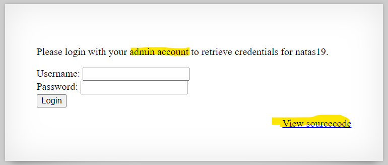
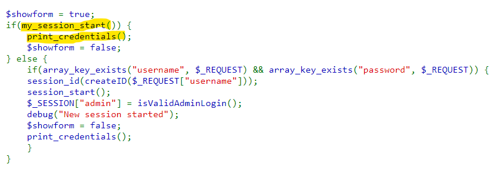
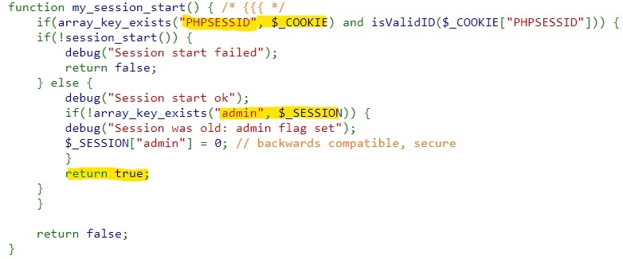
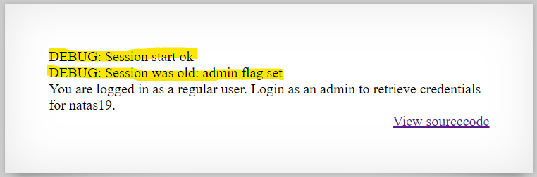
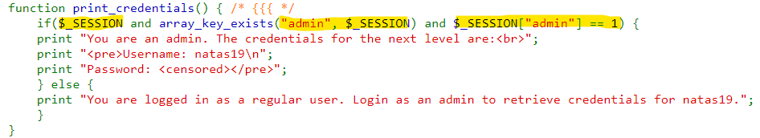
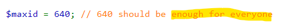

# Level 17 → Level 18

## Details
Username: `natas18`<br />
Password: `8NEDUUxg8kFgPV84uLwvZkGn6okJQ6aq`<br />
URL:      http://natas18.natas.labs.overthewire.org

## Solution






So, let's see what happens using the `debug` parameter to a GET HTTP request. (I didn't take a picture of the ability of this parameter, it appears in almost every challenge. The goal is to see what happens inside through printing)




From these prints it can be concluded that there was no `"admin"` in `$_SESSION`. But how can I insert `"admin"` into the `$_SESSION` details? After all, it is saved on the server. And unlike a `$_COOKIE`, I have no control over it... Not clear now. We will continue to the `print_creadentials()` function:



That is, the value of the key `"admin"` in `$_SESSION` needs to be 1, and we have no control over that. But there is another interesting thing here...



The creation of sessions is limited! This means that one of the sessions may be the admin's. We have control over the current session number using PHPSESSION in the `$_COOKIE`:


## Password for the next level:
```

```
