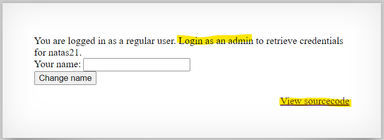

# Level 19 → Level 20

## Details
Username: `natas20`<br />
Password: `guVaZ3ET35LbgbFMoaN5tFcYT1jEP7UH`<br />
URL:      http://natas20.natas.labs.overthewire.org

## Solution



You can read about [sessions](https://www.tutorialspoint.com/php/php_sessions.htm) and function [session_set_save_handler()](https://www.tutorialspoint.com/php/php_function_session_set_save_handler.htm). it's very helpfull.


So although we cannot directly name the `PHPSESSID` of the admin, we can make the session **be the admin** because of the way the `myread()` function extracts the information.

The function restores the values of the session according to the file that looks like this:
```
key value
key value
...
...
```

And when changing the name, **the input is not checked**.
Therefore, given a session, we will change the name so that when saving in the file, a new line will be created in it which is `admin 1`.

For example:
* We change the name of the current session to be `someName\nadmin 1`
* The new file to save this session info will looks like this:
    ```
    name someName
    admin 1
    ```
* And now when we surf again with the same session, restoring his details using the `myread()` function will cause it to be considered as admin.

Lets do it!


`%0D%0A` is `\n`


all this input saves as a name


try again to use the same session


## Password for the next level:
```
89OWrTkGmiLZLv12JY4tLj2c4FW0xn56
```
