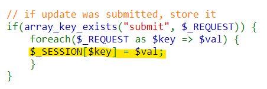
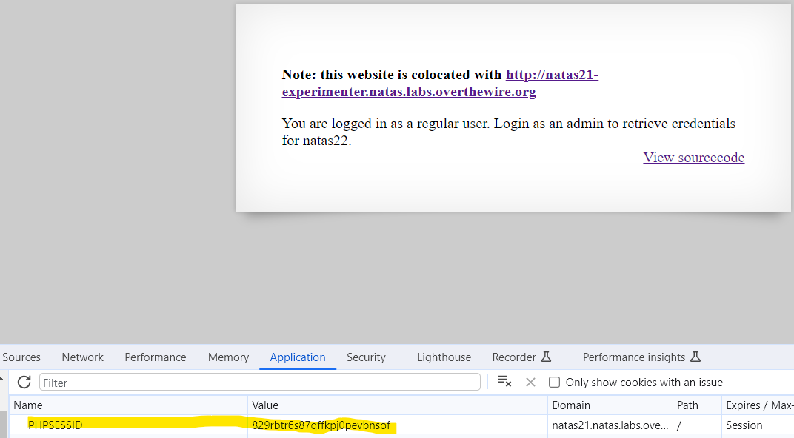

# Level 20 → Level 21

## Details
Username: `natas21`<br />
Password: `89OWrTkGmiLZLv12JY4tLj2c4FW0xn56`<br />
URL:      http://natas21.natas.labs.overthewire.org

## Solution


That means there are two sites in this challenge. The current site, and the site at http://natas21-experimenter.natas.labs.overthewire.org. Let's start with the sourcecode of the current site:


There is not much to do on this site, all that is needed is for the session to belong to the admin. We will now go to the second site:




This means that it is possible, through HTTP parameters, to create any values for the session that I want. From the previous challenge I know that the session details are saved on the server in a designated place **but I did not see that there is a separation between domains**. So maybe we can edit the session of the first site using the second site:




## Password for the next level:
```
91awVM9oDiUGm33JdzM7RVLBS8bz9n0s
```
