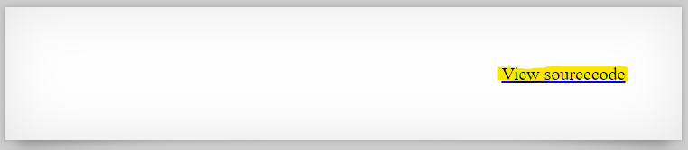
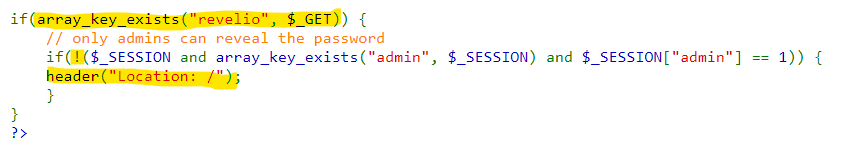
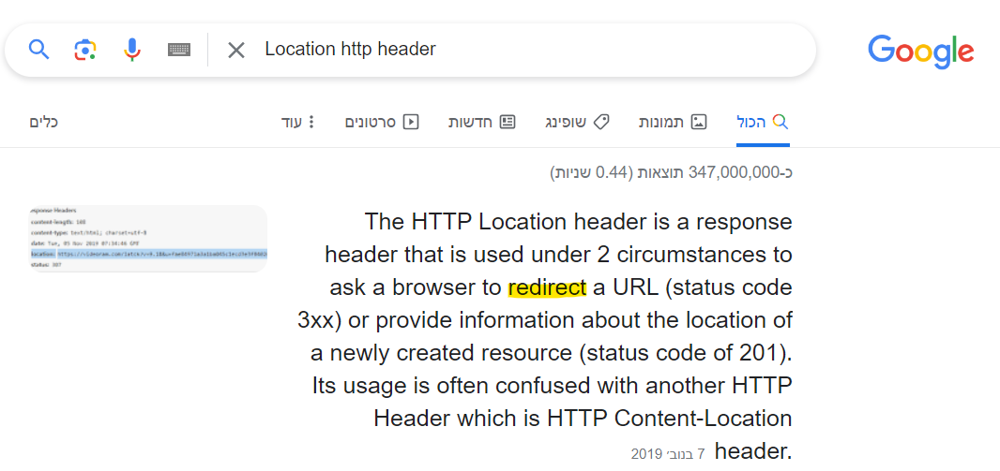
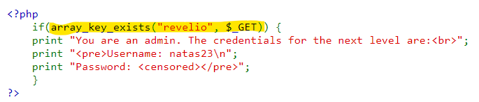
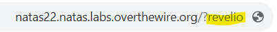
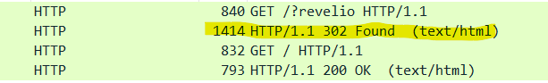
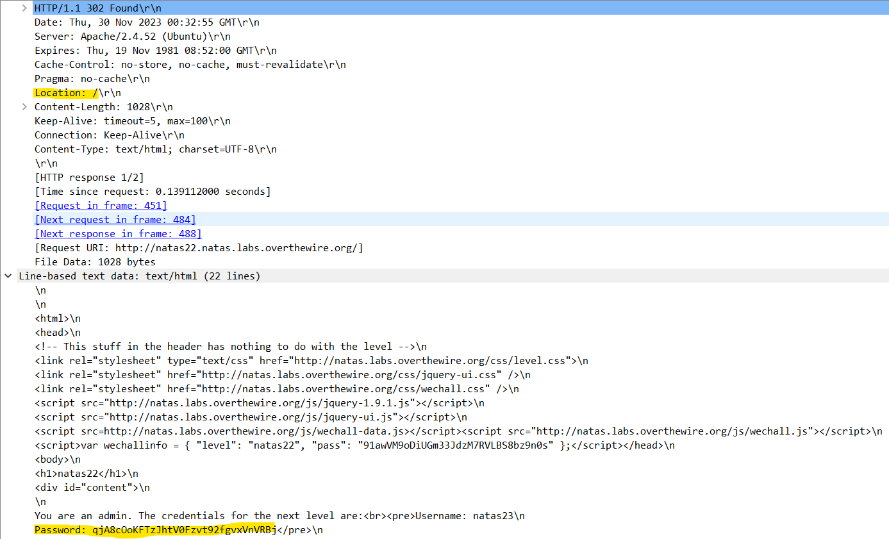

# Level 21 → Level 22

## Details
Username: `natas22`<br />
Password: `91awVM9oDiUGm33JdzM7RVLBS8bz9n0s`<br />
URL:      http://natas22.natas.labs.overthewire.org

## Solution






That is, if the `revelio` parameter exists AND I'm not in the administrator's session either, then the answer that comes back will cause the browser to turn to the site's index again (and this will **hide the page that comes back**, because of the speed with which things happen). But what does the returned page contain? The answer is here:



Therefore, to see what is really happening, we will send a GET request with the `revelio` parameter and sniff the traffic:







## Password for the next level:
```
qjA8cOoKFTzJhtV0Fzvt92fgvxVnVRBj
```
