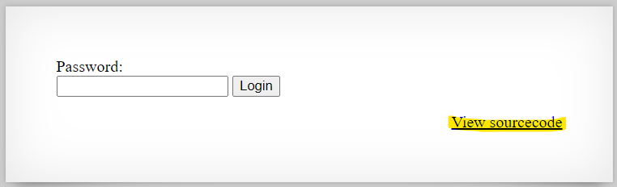
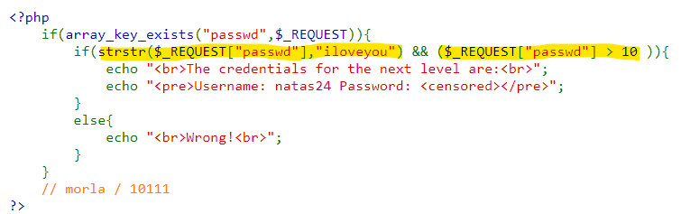
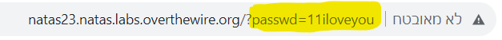
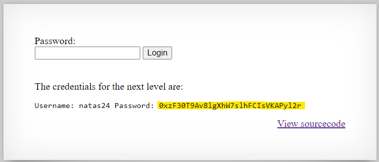

# Level 22 → Level 23

## Details
Username: `natas23`<br />
Password: `qjA8cOoKFTzJhtV0Fzvt92fgvxVnVRBj`<br />
URL:      http://natas23.natas.labs.overthewire.org

## Solution




I read about [strstr()](https://www.w3schools.com/php/func_string_strstr.asp) function. So a parameter named `passwd` should appear in the HTTP request whose value is on the one hand **a string** containing the word `iloveyou` and on the other hand **a number** greater than 10.

I asked to check what happens when strings are compared to numbers in php and I found [this](https://wiki.php.net/rfc/string_to_number_comparison).
All you have to do is add digits before the string `iloveyou`.

for example: `11iloveyou`





## Password for the next level:
```
0xzF30T9Av8lgXhW7slhFCIsVKAPyl2r
```
