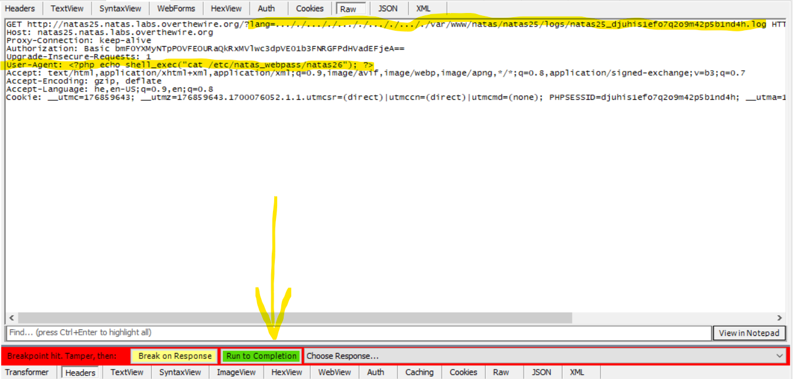

# Level 24 → Level 25

## Details
Username: `natas25`<br />
Password: `O9QD9DZBDq1YpswiTM5oqMDaOtuZtAcx`<br />
URL:      http://natas25.natas.labs.overthewire.org

## Solution

* The text is hidden because it is rude and disgusting.


That is, given the `lang` parameter, we will include the file in the page. But, there is a sanity check that removes all occurrences of `../` from the parameter (to avoid from directory traversal), and makes sure that it is not a path to the password file (which does not have `natas_webpass`).

When one of the tests fails, a log file is written:


The `user-agent` HTTP header is written to the log and the path of the log is `/var/www/natas/natas25/logs/natas25_<PHPSESSID>.log`.

We can immediately conclude that the current site is located in the `/natas25` folder. If we want to display the log file, all we need is to give its path to the `lang` parameter.
* Note: remember that the path that comes from `lang` is cames immediately after the `/language` folder. (`/language/$_REQUEST["lang"]`) And so we will have to do a **directory traversal** like this:

```
http://natas25.natas.labs.overthewire.org/?lang=../logs/natas25_<PHPSESSID>.log
```

But then before accessing the file, the `../` part will be omitted. And so inside it we put another `../` like this: `..././` and when the middle part is omitted, the original remains. So the URL will look like this:

```
http://natas25.natas.labs.overthewire.org/?lang=..././logs/natas25_<PHPSESSID>.log
```

For example:


But can we get the password file itself? Let's see.
* The path of the log file is `/var/www/natas/natas25/logs/natas25_<PHPSESSID>.log`.
* And you can get to it as well:
    ```
    http://natas25.natas.labs.overthewire.org/?lang=..././..././..././..././..././var/www/natas/natas25/logs/natas25_<PHPSESSID>.log
    ```
* We know that the password file is in `/etc/natas_webpass/natas26`
* Therefore we can conclude that the following input will work:
    ```
    http://natas25.natas.labs.overthewire.org/?lang=..././..././..././..././..././etc/natas_webpass/natas26
    ```
    

* But because of the second test, we reached `exit(-1)` and no file was included.

To make sure there is no mistake in the URL, I tried to import another files from the path of `/etc`. For example: `/etc/passwd`:


it worked. I tried for a long time to bypass the `strstr()` check on the `natas_webpass` string without success. So I wanted to try another direction that we have control over... like the `user-agent` header.

Can we change the `user-agent` so that it prints the password file inside the log, and then print the log? let's try:


Stop the HTTP trafic with **fiddler**:


* This is the same PHP code like level **Level11 to Level12**


* After the **time**, the **user-agent** should appear. In our case, it's a 32-character string. that is, the password.

## Password for the next level:
```
8A506rfIAXbKKk68yJeuTuRq4UfcK70k
```
