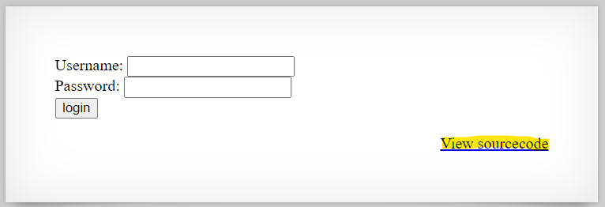

# Level 26 → Level 27

## Details
Username: `natas27`<br />
Password: `PSO8xysPi00WKIiZZ6s6PtRmFy9cbxj3`<br />
URL:      http://natas27.natas.labs.overthewire.org

## Solution
This is one of the tags that took me a very long time. Let's get started:



This is the sourcecode:
```php
// morla / 10111
// database gets cleared every 5 min


/*
CREATE TABLE `users` (
  `username` varchar(64) DEFAULT NULL,
  `password` varchar(64) DEFAULT NULL
);
*/


function checkCredentials($link,$usr,$pass){

    $user=mysqli_real_escape_string($link, $usr);
    $password=mysqli_real_escape_string($link, $pass);

    $query = "SELECT username from users where username='$user' and password='$password' ";
    $res = mysqli_query($link, $query);
    if(mysqli_num_rows($res) > 0){
        return True;
    }
    return False;
}


function validUser($link,$usr){

    $user=mysqli_real_escape_string($link, $usr);

    $query = "SELECT * from users where username='$user'";
    $res = mysqli_query($link, $query);
    if($res) {
        if(mysqli_num_rows($res) > 0) {
            return True;
        }
    }
    return False;
}


function dumpData($link,$usr){

    $user=mysqli_real_escape_string($link, trim($usr));

    $query = "SELECT * from users where username='$user'";
    $res = mysqli_query($link, $query);
    if($res) {
        if(mysqli_num_rows($res) > 0) {
            while ($row = mysqli_fetch_assoc($res)) {
                // thanks to Gobo for reporting this bug!
                //return print_r($row);
                return print_r($row,true);
            }
        }
    }
    return False;
}


function createUser($link, $usr, $pass){

    if($usr != trim($usr)) {
        echo "Go away hacker";
        return False;
    }
    $user=mysqli_real_escape_string($link, substr($usr, 0, 64));
    $password=mysqli_real_escape_string($link, substr($pass, 0, 64));

    $query = "INSERT INTO users (username,password) values ('$user','$password')";
    $res = mysqli_query($link, $query);
    if(mysqli_affected_rows($link) > 0){
        return True;
    }
    return False;
}


if(array_key_exists("username", $_REQUEST) and array_key_exists("password", $_REQUEST)) {
    $link = mysqli_connect('localhost', 'natas27', '<censored>');
    mysqli_select_db($link, 'natas27');


    if(validUser($link,$_REQUEST["username"])) {
        //user exists, check creds
        if(checkCredentials($link,$_REQUEST["username"],$_REQUEST["password"])){
            echo "Welcome " . htmlentities($_REQUEST["username"]) . "!<br>";
            echo "Here is your data:<br>";
            $data=dumpData($link,$_REQUEST["username"]);
            print htmlentities($data);
        }
        else{
            echo "Wrong password for user: " . htmlentities($_REQUEST["username"]) . "<br>";
        }
    }
    else {
        //user doesn't exist
        if(createUser($link,$_REQUEST["username"],$_REQUEST["password"])){
            echo "User " . htmlentities($_REQUEST["username"]) . " was created!";
        }
    }

    mysqli_close($link);
} else {
```

The code can be summarized as follows:
* If there is a username and password
     * Check if user exists
         * If so print details if they are correct
    * If the user does not exist, create it.

I wasted a lot of time trying to bypass the `mysqli_real_escape_string` function. After reading a lot I came to the conclusion that **there is no sql injection in this challenge**.
One of the things I suspected was the piece of code that checks spaces (`trim` function) at the ends of the username, and if there are any it will print "go away hacker". Because I didn't see how it made sense in the code.

Another piece of code I suspected was inserting a new user into the table. Why cut off the username and password if they are too long? Why not let it fail and that's it? Is it necessary to put in some long input that thanks to the fact that it is cut it will be possible to do something?

With these questions in mind, I realized that there is something here that I don't know about sql. And so I sadly went to read a [solution](https://n0j.github.io/2017/07/20/otw-natas-27.html).
This solution is so beautiful, that in my opinion it is a must read for anyone who wants to ever mess with sql.

Inputs:
*   Username: `natas28                                                         _`<br />
    Password: `password`

* Username: `natas28`<br />
  Password: `password`
## Password for the next level:
```
skrwxciAe6Dnb0VfFDzDEHcCzQmv3Gd4
```
