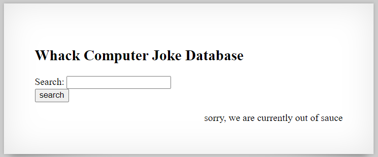
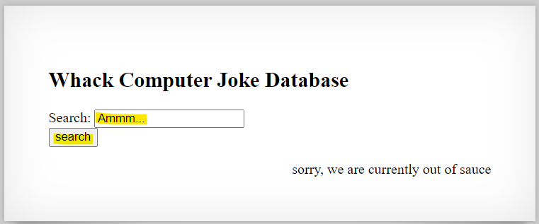
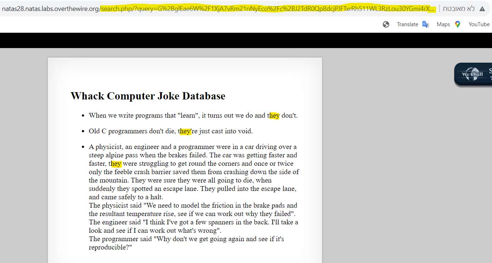
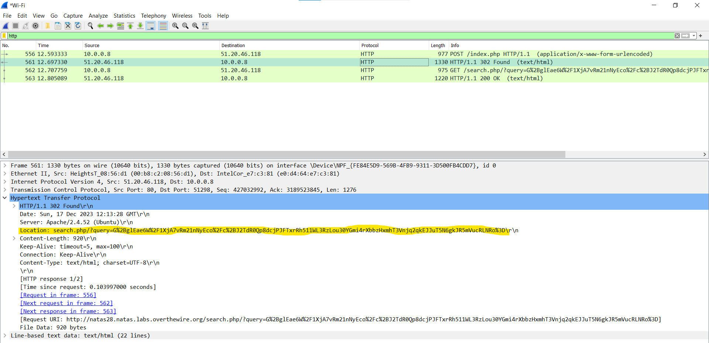
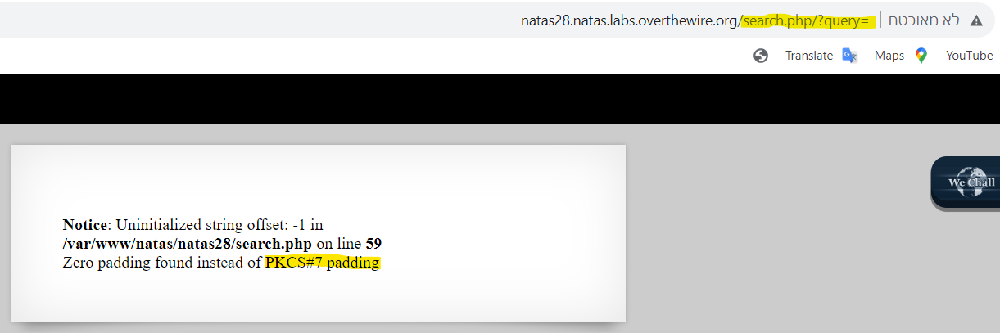

# Level 27 → Level 28

## Details
Username: `natas28`<br />
Password: `skrwxciAe6Dnb0VfFDzDEHcCzQmv3Gd4`<br />
URL:      http://natas28.natas.labs.overthewire.org

## Solution






Well, there is a case of HTTP redirect here. Let's see it in Wireshark:



I tried playing a bit with the **query** parameter...




## Password for the next level:
```

```
