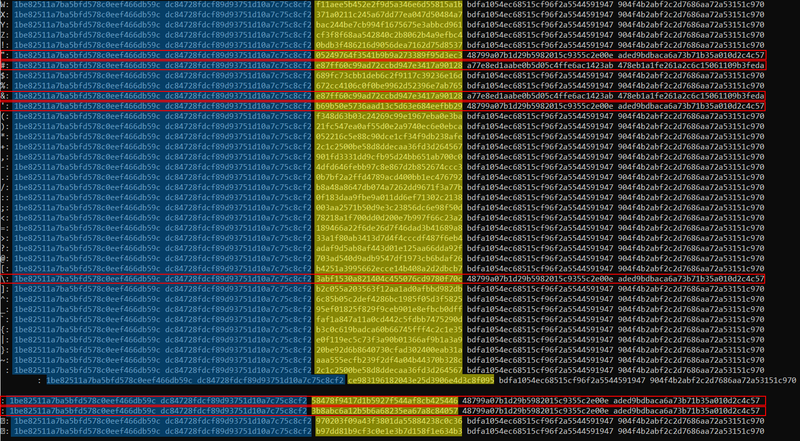
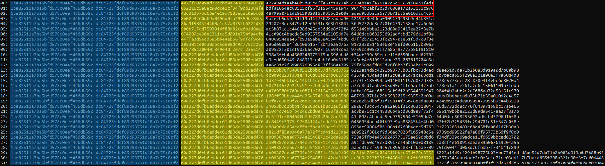

# Level 27 → Level 28

## Details
Username: `natas28`<br />
Password: `skrwxciAe6Dnb0VfFDzDEHcCzQmv3Gd4`<br />
URL:      http://natas28.natas.labs.overthewire.org

## Solution


Well, there is a case of HTTP redirect here. Let's see it in Wireshark:


I tried playing a bit with the **query** parameter...


I looked into what [PKCS#7 padding](https://medium.com/asecuritysite-when-bob-met-alice/so-what-is-pkcs-7-daf8f4423fd1) is... but didn't have much to do with it at the moment.

So, I decided to look deeper into the strange parameter sent by the site itself. It was very easy to understand that it was base64, so I created a program that prints the original bytes that are sent to the query for many inputs:

```python
from requests import get
from requests.auth import HTTPBasicAuth
from urllib.parse import unquote
from base64 import b64decode
from string import printable

# Current level details
natas28_username = "natas28"
natas28_password = "skrwxciAe6Dnb0VfFDzDEHcCzQmv3Gd4"

# GET HTTP details
URL = "http://natas28.natas.labs.overthewire.org/?query={0}"
AUTH = HTTPBasicAuth(natas28_username, natas28_password)

for c in printable:
    res = get(url=URL.format(c), auth=AUTH, allow_redirects=False)
    new_location = res.headers['Location'].split('=')[-1]
    print(bytes.hex(b64decode(unquote(new_location))))
```


that's very weird. Everything is the same except for a 16-byte part in the middle.
Let's print again separating into groups of 16 bytes:

```python
from requests import get
from requests.auth import HTTPBasicAuth
from urllib.parse import unquote
from base64 import b64decode
from string import printable

# Current level details
natas28_username = "natas28"
natas28_password = "skrwxciAe6Dnb0VfFDzDEHcCzQmv3Gd4"

# GET HTTP details
URL = "http://natas28.natas.labs.overthewire.org/?query={0}"
AUTH = HTTPBasicAuth(natas28_username, natas28_password)

for c in printable:
    res = get(url=URL.format(c), auth=AUTH, allow_redirects=False)
    new_location = res.headers['Location'].split('=')[-1]
    decoded = bytes.hex(b64decode(unquote(new_location)))
    print(c + ":", ' '.join([decoded[i*2*16:(i+1)*2*16] for i in range(len(decoded)//(2*16))]))
```



A number of things can be concluded from looking at the output.
* Each row can be divided into 3 parts in this order:
    * Fixed part<br />
    `1be82511a7ba5bfd578c0eef466db59c dc84728fdcf89d93751d10a7c75c8cf2`
    * Variable part (probably depends on input from the user)
    * A part that in most cases looks the same except for the characters `"`, `#`, `&`, `'`, `\`, `\n`, `\r`

* It seems that the input from the user has been padded to 16 bytes, and encrypted.

I decided to try another approach, which is to see what happens when the input size changes. How does it affect?

```python
from requests import get
from requests.auth import HTTPBasicAuth
from urllib.parse import unquote
from base64 import b64decode

# Current level details
natas28_username = "natas28"
natas28_password = "skrwxciAe6Dnb0VfFDzDEHcCzQmv3Gd4"

# GET HTTP details
URL = "http://natas28.natas.labs.overthewire.org/?query={0}"
AUTH = HTTPBasicAuth(natas28_username, natas28_password)

for i in range(32):
    res = get(url=URL.format('*'*i), auth=AUTH, allow_redirects=False)
    new_location = res.headers['Location'].split('=')[-1]
    decoded = bytes.hex(b64decode(unquote(new_location)))
    print(str(i).zfill(2) + ":", ' '.join([decoded[i*2*16:(i+1)*2*16] for i in range(len(decoded)//(2*16))]))
```



And from this I deduced the following:
* The third part of the line actually depends on the second part. (Here it is expressed because of the size of the input).
* It is possible that what actually happens is a combination of the input from the user within an existing string (for example an sql query), padding and encryption.
* We have no control over the first part.
* The characters `&` and `#` are removed from the input
* The characters `\`, `\r`, `\n`, `"`, `'` increase the input by one character.

Therefore, the order of operations on the server is as follows:
1. The input comes from the user
2. The characters `&` and `#` are removed from it
3. The input goes through the `mysqli_real_escape_string` function
4. The input is integrated into a sql query and padded to a 16-byte division (probably with PKCS#7 padding)
5. The query undergoes some kind of block encryption and is sent as a parameter to the redirect.<br />
It also makes sense because of the parameter name, **"quary"**.

Can we generate a `select * from users where username='natas28'` style query ourselves and send? No. Because we don't know the encryption and its key...

So what can we do?

## Password for the next level:
```

```
