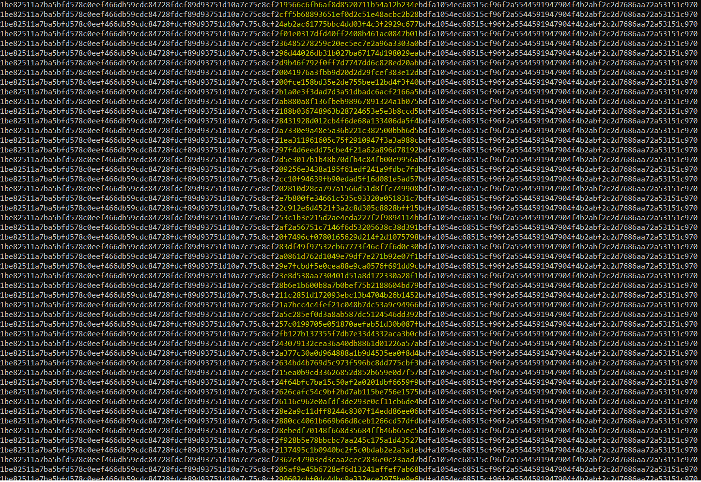

# Level 27 → Level 28

## Details
Username: `natas28`<br />
Password: `skrwxciAe6Dnb0VfFDzDEHcCzQmv3Gd4`<br />
URL:      http://natas28.natas.labs.overthewire.org

## Solution


Well, there is a case of HTTP redirect here. Let's see it in Wireshark:


I tried playing a bit with the **query** parameter...


I then decided to look deeper into the strange parameter sent by the site itself. It was very easy to understand that it was base64, so I created a program that prints the original bytes that are sent to the query for many inputs:

```python
from requests import get
from requests.auth import HTTPBasicAuth
from urllib.parse import unquote
from base64 import b64decode
from string import printable

# Current level details
natas28_username = "natas28"
natas28_password = "skrwxciAe6Dnb0VfFDzDEHcCzQmv3Gd4"

# GET HTTP details
URL = "http://natas28.natas.labs.overthewire.org/?query={0}"
AUTH = HTTPBasicAuth(natas28_username, natas28_password)

for c in printable:
    res = get(url=URL.format(c), auth=AUTH, allow_redirects=False)
    new_location = res.headers['Location'].split('=')[-1]
    print(bytes.hex(b64decode(unquote(new_location))))
```



that's very weird. Everything is the same except for a 16-byte part in the middle.
Let's print again separating into groups of 16 bytes:

```python
from requests import get
from requests.auth import HTTPBasicAuth
from urllib.parse import unquote
from base64 import b64decode
from string import printable

# Current level details
natas28_username = "natas28"
natas28_password = "skrwxciAe6Dnb0VfFDzDEHcCzQmv3Gd4"

# GET HTTP details
URL = "http://natas28.natas.labs.overthewire.org/?query={0}"
AUTH = HTTPBasicAuth(natas28_username, natas28_password)

for c in printable:
    res = get(url=URL.format(c), auth=AUTH, allow_redirects=False)
    new_location = res.headers['Location'].split('=')[-1]
    decoded = bytes.hex(b64decode(unquote(new_location)))
    print(c + ":", ' '.join([decoded[i*2*16:(i+1)*2*16] for i in range(len(decoded)//(2*16))]))
```


## Password for the next level:
```

```
